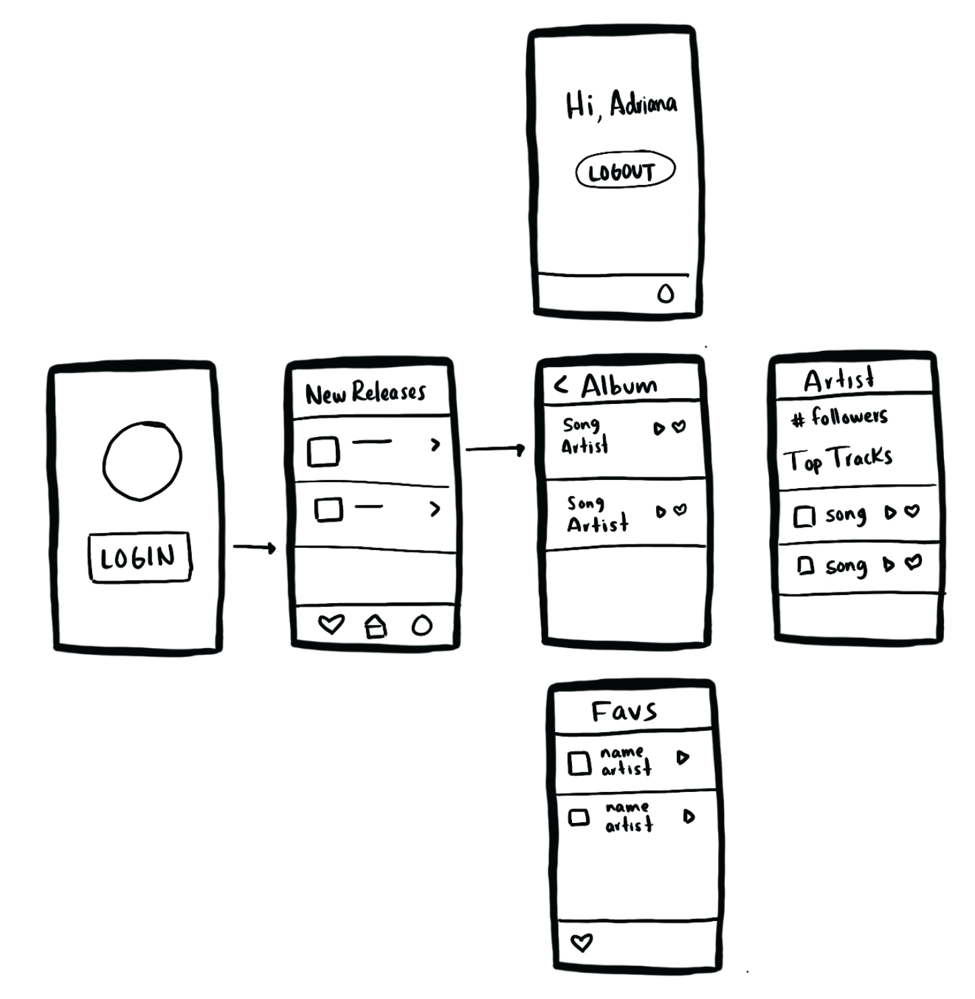

# Music Player App

## Introduction

So far in your journey as an iOS developer, you've learned how to: build responsive UI, structure an app using MVC, persist data locally and remotely, interact with a backend service and used a variety of APIs available by Apple.

There are still many other topics you can explore, but with what you know today, you are able to build apps for any domain you can think of.

This project will combine your current expertise with the content from MOB 2.3 so that you understand why we do certain things to deal with optimization and thread handling.

## Learning Outcomes

By the end of this project, you should be able to...

1. Build a functional app that satisfies the requirements listed below
1. Implement common practices to aid with concurrency and persistence in an iOS app.
1. Use GCD to work with the main and background threads.
1. Use Apple's API AVFoundation to handle audio files.
1. Familiarize with your own code and be capable of explaining your coding decisions.

## Description

Your task is to create an app that let's users check out their 10 most played artists on Spotify *(up to you if you want to change this to a different top 10 in Spotify)*. The app will also let users preview songs and save the as favorite songs.

- There's a login page to authenticate the user with Spotify's API/SDK
- The home page should display the 10 most played artists on Spotify by the user.
- When you tap on an artist, you will go to another view controller to view each individual artist and show their 10 most popular songs.
- Users can listen to a preview of the songs.
- Users can also save songs by marking them as favorite.
- There's another view controller to list all of your favorite songs. You can preview the song from this VC too.

Check the resources for helpful documentation!

## Requirements

1. Adhere to the description.
1. You must use the [Spotify API](https://developer.spotify.com/documentation/web-api/) or [Spotify SDK](https://developer.spotify.com/documentation/ios/)
1. Allow for the tracks to be previewed (30-sec clips), use AVFoundation
1. Use a persistence method to save the favorite tracks, up to your criteria which one to use.
1. Use GCD to handle concurrency.
1. Authenticate users with the Spotify API/SDK - should also be able to log out

## Stretch challenges

1. Add favorite songs directly to a user's playlist in Spotify
1. Get creative with your designs!
1. Implement Apple Sign In

## Wireframes

## Rubric

You must score at least 70 points to pass the assignment. Breakdown of points below:

1. **(20 points):** Code Quality: intuitive variable names, conventional casing, clear comments, modules are flexible and local, short line lengths, proper formatting.
1. **(10 points)** Create a usable design that follows iOS UI Guidelines
1. **(15 points)** Displays 10 most played artists
1. **(15 points)** Tracks can be previewed
1. **(15 points)** Each artist has a view that displays the top 10 tracks by the artist
1. **(15 points)** Ability to favorite a top track, and view all favorites in a list in a separate view
1. **(5 points)** Uses Spotify API/SDK
1. **(5 points)** Code on GitHub

## Resources
- [Spotify API Docs](https://developer.spotify.com/documentation/web-api/)
- [Spotify SDK Docs](https://developer.spotify.com/documentation/ios/)
- [Spotify Authorization Guide](https://developer.spotify.com/documentation/general/guides/authorization-guide/)
