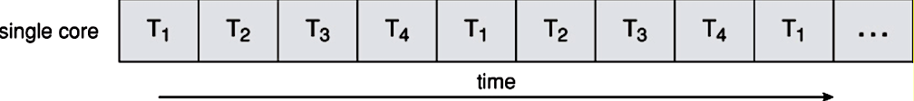
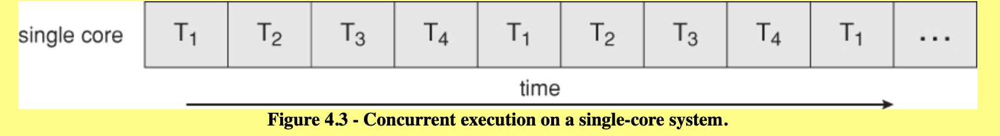

# Concurrency & Parallelism

## Minute-by-Minute [OPTIONAL]

| **Elapsed** | **Time**  | **Activity**              |
| ----------- | --------- | ------------------------- |
| 0:00        | 0:05      | Objectives                |
| 0:05        | 0:15      | Overview                  |
| 0:20        | 0:45      | In Class Activity I       |
| 1:05        | 0:10      | BREAK                     |
| 1:15        | 0:45      | In Class Activity II      |
| TOTAL       | 2:00      |                           |

## Why you should know this (5 min)

**Q:** *Why do apps need concurrent activities?*

**A:** *To keep the UI responsive.*

When you create a new iOS app, the app acquires its `main` thread. That `main` thread is responsible for running all of the code that powers the app's user interface.

As you add code on your `main` thread that performs large items of non-UI work &mdash; such as image processing or fetching and transforming data  &mdash; you will find that your UI's performance suffers drastically.

Your user interface will slow down, or maybe even stop entirely.

A common example:
- A table view that will not scroll properly while the app is downloading and transforming images; multiple "busy" indicators are displayed instead of expected images.

The concept of __*Concurrency*__ in iOS is about how to structure your app to avoid such UI performance issues by directing  slow, non-UI tasks to run somewhere other than on the UI thread (aka, the `main` thread).

Concurrency issues loom large in any list of the top mistakes made by iOS developers. They are also the underlying cause of the majority of negative app reviews.

Thus it is not surprising that questions on iOS concurrency are now a standard part of the technical interview process for iOS development jobs.

## Learning Objectives (5 min)

<!-- 1. Identify and describe
1. Define
1. Design
1. Implement -->

<!-- By the end of this lesson, you should be able to...

1. Describe and implement basic examples of:
- Optional ways for creating **Observables**  
- **Hot & Cold Observables**
- **Subjects** - A special type of Observable
- **Schedulers**
- Key Rx **Operators** selected from the roster of operator types available in RxSwift/RxCocoa -->

## Initial Exercise (15 min)

<!-- - Funny comic
- Prime the Pump (e.g. think and jot, think pair share, etc)
- Productivity Tip/Tool
- Review of current event (e.g. tech news relevant to your track/topic)
- Quiz on homework or topic(s) of past class
- Concept Test -->

## Overview/TT I (20 min)

### Terms & Concepts

Key concepts covered in this course will include...

- Process
- Thread
- Task
- Multi-Core Systems
- Concurrency
- Parallelism
- Queues (Serial, Concurrent)
- Synchronous vs Asynchronous
- Grand Central Dispatch (GCD)
- Background Tasks
- Quality of Service (QoS)
- Operations
- Dispatch Groups
- Semaphores
- Debugging
- Testing

### Challenges

Concurrency presents specific development challenges. The course will introduce the following challenges, along with standard approaches to avoiding and/or resolving them:

- Deadlocks
- Race Conditions
- Readers-Writers Problem
- Thread Explosions
- Priority Inversion

### Essential Initial Concepts

#### Processes, Threads & Tasks

**Process** &mdash; The runtime instance of an application. A process has its own virtual memory space (aka, virtual machine) and system resources (including port rights) that are independent of those assigned to other programs.

- A process always contains at least one thread (the main thread) and may contain any number of additional threads.

**Thread** &mdash; A flow of execution inside a process, a __*thread of execution*__ is the *smallest sequence* of programmed instructions that can be managed independently by the operating system's (thread) scheduler.

- Each thread has its own (application) stack space but otherwise shares memory with other threads in the same process.

- A thread defines a discrete mechanism, within a single process, for executing tasks

- Threads can execute concurrently, but that is up to the operating system.

<!-- TODO: turn comparison into table -->

Comparison Notes:
- processes are typically independent, while threads exist as *subsets* of a process.
- processes have separate address spaces; threads share their address space with other threads in the same process.
- processes carry considerably more state information than threads, whereas multiple threads within a process share process state as well as memory and other resources.

**Task** &mdash; A quantity of work to be performed.

- A task is simply some work that your application needs to perform (some Block of code)

For examples, you could create a task to perform some calculations, blur an image, create or modify a data structure, process some data read from a file, convert JSON data, fetch data from local/remote sources.

*Sources:*  
- Wikipedia
- Apple Concurrency Programming

### Where do tasks run?

Tasks run on threads...

- The UI (and all UI-related tasks) runs on the Main thread, which is automatically created by the System.
- The System also creates other threads for its own tasks. Your app can use these threads...or create its own threads.

#### Parallel Computing (Parallelism)

Parallel programming utilizes a shift from procedural tasks to tasks that run at the same time.

In Parallel Computing:

- Many calculations or the execution of processes are carried out __*simultaneously.*__

- A computational task is typically broken down into several very similar __*sub-tasks*__ that can be processed independently and whose results are combined after all tasks are completed.

> Note that there are several different forms of Parallel Computing: bit-level, instruction-level, data, and task parallelism.

<!--
### Concurrency & Concurrent Computing

**Concurrency** refers to the ability to decompose a program, algorithm, or problem into components or units that can be executed out-of-order or in partial order without affecting the final outcome.

Concurrency is the act of dividing up work.

This allows for parallel execution of the concurrent units, which can significantly improve overall speed of the execution in multi-processor and multi-core systems.

Concurrent Computing is an example of one of the four forms of Parallel Computing, [task parallelism](https://en.wikipedia.org/wiki/Task_parallelism), which focuses on distributing tasks — __*concurrently*__ performed by processes or threads — across different processors. -->

### Concurrency

**Concurrency** refers to the ability to __*decompose*__ a program, algorithm, or problem into smaller components or units that can be executed out-of-order, or in partial order, without affecting the final outcome.

Concurrency is the act of dividing up work.

This allows for *parallel execution* of the concurrent units, which can significantly improve overall speed of execution in multi-processor and multi-core systems.

### Processors / Cores

A recent trend in computer architecture is to produce chips with multiple cores (CPUs) on a single chip, a trend driven by concerns over excessive heat generated by increased power consumption.

With the advent of modern multi-core central processing units, parallel computing has become the dominant paradigm in computer architecture due to its potential to optimize performance.

Multi-core devices execute multiple threads at the same time via Parallelism.

Parallel Computing is closely related to Concurrent Computing — they are frequently used together, and often conflated, though the two are distinct:

- it is possible to have __*parallelism without concurrency*__ (such as bit-level parallelism)
- it is also possible to have __*concurrency without parallelism*__ (such as multitasking by time-sharing on a single-core CPU).

### What does it mean for a task to run concurrently?

Tasks run on threads.

But for threads to execute tasks *concurrently,* must multiple threads run at the same time?

Single-core devices can achieve concurrency through __*time-slicing,*__ in which the OS uses "context switching" to alternate between multiple threads.

For a *multi-threaded application* running on a traditional *single-core chip,* the OS would run one thread, perform a context switch, then run another thread, as illustrated in the first diagram below where T1 (Thread 1) pauses while threads 2 thru 4 run, then T1 resumes, etc.:

  

On a multi-core chip, the threads could be spread across all available cores, allowing __*true parallel processing,*__ as shown here:

  

*Source:*  
https://www.cs.uic.edu/~jbell/CourseNotes/OperatingSystems/4_Threads.html

### How to use concurrency?

In general, by structuring your apps so that some tasks can run at the same time.

Tasks which can run at same time:

- tasks that access different resources

- tasks that only read values

> Note: Tasks that modify the *same* resource __*must not*__ run at the same time, unless the resource is `threadsafe` (we'll > cover thread safety later in the course)

## In Class Activity I (30 min)

< Movie Theatre game? >

## Overview/TT II (optional) (20 min)

### Concurrency on iOS

#### ipHone hardware

iPhones and iPads have been dual-core since 2011...

- How many cores on an iPhone?

### Anatomy of an iOS app

#### VMs, Processes, & threads

<!-- Performance. Responsiveness. They're not sexy tasks. When done properly, nobody is going to thank you. When done incorrectly, app retention is going to suffer and you'll be dinged during your next yearly performance review.
There are a multitude of ways in which an app can be optimized for speed, performance and overall responsiveness. This book will focus on the topic of concurrency. -->

<!-- your app runs as smoothly as possible and that the end user is not ever forced to wait for something to happen. A second is a minuscule amount of time for most everything not related to a computer. However, if a human has to wait a
 raywenderlich.com 15
Concurrency by Tutorials Chapter 1: Introduction second to see a response after taking an action on a device like an iPhone, it feels like
an eternity. "It's too slow" is one of the main contributors to your app being uninstalled. -->

<!-- Scrolling through a table of images is one of the more common situations wherein the end user will be impacted by the lack of concurrency. If you need to download an image from the network, or perform some type of image processing before displaying it, the scrolling will stutter and you'll be forced to display multiple "busy" indicators instead of the expected image. -->

#### queues

### Intro to GCD

## In Class Activity II (optional) (30 min)

< ? >

<!-- - I do, We do, You do
- Reading & Discussion Questions in small groups
- Draw a picture/diagram
- Complete Challenges solo or in pair
- Q&A about tutorials
- Pair up and code review
- Pair program
- Formative assessment
- Form into groups
- etc (get creative :D) -->

## After Class
1. Research:
-
2. Assignment:
-

## Wrap Up (5 min)

- Continue working on your current tutorial
- Complete reading
- Complete challenges

## Additional Resources

1. [Slides]()
2. 
3. 
4. 
5. 

https://en.wikipedia.org/wiki/Concurrency_(computer_science)

https://en.wikipedia.org/wiki/Amdahl%27s_law

https://en.wikipedia.org/wiki/Apple-designed_processors

https://www.cs.uic.edu/~jbell/CourseNotes/OperatingSystems/4_Threads.html
