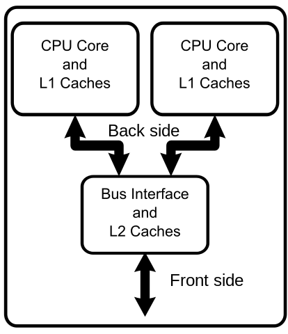
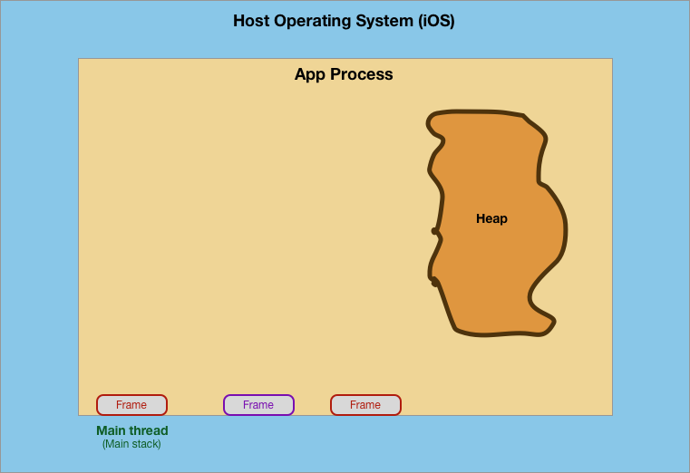

# Concurrency & Parallelism

## Minute-by-Minute [OPTIONAL]

| **Elapsed** | **Time**  | **Activity**              |
| ----------- | --------- | ------------------------- |
| 0:00        | 0:10     | Objectives                |
| 0:10        | 0:20      | Overview I               |
| 0:30        | 0:30      | In Class Activity I       |
| 1:00        | 0:10      | BREAK                     |
| 1:10        | 0:20      | Overview II               |
| 1:25        | 0:20      | In Class Activity II      |
| TOTAL       | 1:45      |                           |

## Learning Objectives (5 min)

<!-- 1. Identify and describe
1. Define
1. Design
1. Implement -->

<!-- By the end of this lesson, you should be able to...

1. Describe and implement basic examples of:
- Optional ways for creating **Observables**  
- **Hot & Cold Observables**
- **Subjects** - A special type of Observable
- **Schedulers**
- Key Rx **Operators** selected from the roster of operator types available in RxSwift/RxCocoa -->

## Why you should know this (5 min)

**Q:** Why do apps need concurrent activities?

**A:** To keep the UI responsive.

When you create a new iOS app, the app acquires its `main` thread. That `main` thread is responsible for running all of the code that powers the app's user interface.

As you add code on your `main` thread to perform large items of non-UI work &mdash; such as image processing or fetching and transforming data  &mdash; you will find that your UI's performance suffers drastically.

Your user interface will slow down, or maybe even stop altogether.

A common example:
- A table view that will not scroll properly while the app is downloading and transforming images; scrolling stutters and you might need to display multiple "busy" indicators of the expected images.

The concept of __*Concurrency*__ in iOS is about how to structure your app to avoid such UI performance issues by directing  slow, non-UI tasks to run somewhere other than on the UI thread (aka, the `main` thread).

Concurrency issues loom large in any list of the top mistakes made by iOS developers. They are also the underlying cause of the majority of negative app reviews.

Thus it is not surprising that questions on iOS concurrency are now a standard part of the technical interview process for iOS development jobs.

## Overview/TT I (20 min)

### Terms & Concepts

Key concepts covered in this course will include:

- Process
- Thread
- Task
- Multi-Core Systems
- Concurrency
- Parallelism
- Queues (Serial, Concurrent)
- Synchronous vs Asynchronous
- Grand Central Dispatch (GCD)
- Background Tasks
- Quality of Service (QoS)
- Operations
- Dispatch Groups
- Semaphores
- Debugging
- Testing Strategies

...we will cover a few of the most essential concepts today...and the rest, we'll cover later in the course...

### Processes & Threads

**Process** &mdash; The runtime instance of an application. A process has its own virtual memory space (aka, virtual machine) and system resources (including port rights) that are independent of those assigned to other programs.

- A process always contains at least one thread (the main thread) and may contain any number of additional threads.

**Thread** &mdash; A *flow* of execution inside a process. A __*thread of execution*__ is the *smallest sequence* of programmed instructions that can be managed independently by the operating system's scheduler.

- Each thread comes with its own __*stack*__ space but otherwise shares memory with other threads in the same process.

- A thread defines a discrete mechanism, within a single process, for executing tasks.

- Threads can execute concurrently, but that is up to the operating system.

**Comparing Processes to Threads**

| Processes | Threads |
| ------------- | ------------- |
| Are typically independent | Threads exist as *subsets* of a process |
| Have separate address spaces | Threads share their address space with other threads in the same process |
| Carry considerably more state information than threads  | Multiple threads within a process share process state as well as memory and other resources  |

### Tasks

**Task** &mdash; A quantity of work to be performed.

A task is simply some work that your application needs to perform (i.e., some block of code to execute).

For examples, you could create a task to perform some calculations, blur an image, create or modify a data structure, process some data read from a file, convert JSON data, or fetch data from local/remote sources.

*Sources:*  
- Wikipedia
- Apple Concurrency Programming

#### Where do tasks run?

Tasks run on threads...

- The UI (and all UI-related tasks) runs on the Main thread, which is automatically created by the system.
- The system also creates other threads for its own tasks. Your app can use these threads...or create its own threads.

### Parallel Computing (Parallelism)

Parallel programming utilizes a shift from procedural tasks, which run sequentially, to tasks that run at the same time.

In Parallel Computing:

- Many calculations or the execution of processes are carried out __*simultaneously.*__

- A computational task is typically broken down into several very similar __*sub-tasks*__ that can be processed independently and whose results are combined after all tasks are completed.

> Note that there are several different forms of Parallel Computing: bit-level, instruction-level, data, and task parallelism.

<!--
### Concurrency & Concurrent Computing

**Concurrency** refers to the ability to decompose a program, algorithm, or problem into components or units that can be executed out-of-order or in partial order without affecting the final outcome.

Concurrency is the act of dividing up work.

This allows for parallel execution of the concurrent units, which can significantly improve overall speed of the execution in multi-processor and multi-core systems.

Concurrent Computing is an example of one of the four forms of Parallel Computing, [task parallelism](https://en.wikipedia.org/wiki/Task_parallelism), which focuses on distributing tasks — __*concurrently*__ performed by processes or threads — across different processors. -->

### Concurrency

**Concurrency** refers to the ability to __*decompose*__ a program, algorithm, or problem into smaller components or units that can be executed out-of-order, or in partial order, without affecting the final outcome.

Concurrency is the act of dividing up work.

This allows for *parallel execution* of the concurrent units, which can significantly improve overall speed of execution on multi-processor and multi-core systems.

### Multiple Processors / Cores

A recent trend in computer architecture is to produce chips with multiple cores (CPUs) on a single chip, a trend driven by concerns over excessive heat generated by increased power consumption.

With the advent of modern multi-core CPUs, Parallel Computing has become the dominant paradigm in computer architecture due to its potential to optimize performance.

Multi-core devices execute multiple threads at the same time via Parallelism.

&nbsp;&nbsp;&nbsp;&nbsp;&nbsp;&nbsp;&nbsp;&nbsp;&nbsp;&nbsp;&nbsp;&nbsp;&nbsp;&nbsp;&nbsp;&nbsp;&nbsp;&nbsp;&nbsp;&nbsp;&nbsp;&nbsp;&nbsp;&nbsp;&nbsp;&nbsp;&nbsp;&nbsp;&nbsp;&nbsp; 

&nbsp;&nbsp;&nbsp;&nbsp;&nbsp;&nbsp;&nbsp;&nbsp;&nbsp; *Diagram of a generic dual-core processor with CPU-local level-1 caches*  
&nbsp;&nbsp;&nbsp;&nbsp;&nbsp;&nbsp;&nbsp;&nbsp;&nbsp; *and a shared, on-die level-2 cache.*

&nbsp;&nbsp;&nbsp;&nbsp;&nbsp;&nbsp;&nbsp;&nbsp;&nbsp; *Source:*  
&nbsp;&nbsp;&nbsp;&nbsp;&nbsp;&nbsp;&nbsp;&nbsp;&nbsp; *CountingPine at English Wikipedia - Public Domain,*  
&nbsp;&nbsp;&nbsp;&nbsp;&nbsp;&nbsp;&nbsp;&nbsp;&nbsp; https://commons.wikimedia.org/w/index.php?curid=11894458

### Are Parallelism and Concurrency the same thing?

Parallel Computing is closely related to Concurrent Computing (in fact, Concurrent Computing is an example of *task parallelism.*)

Concurrency is about structure, while Parallelism is about execution.

Though both are frequently used together, and often conflated, the two concepts are distinct:
- it is possible to have __*parallelism without concurrency*__ (such as bit-level parallelism)
- it is also possible to have __*concurrency without parallelism*__ (such as multitasking by time-sharing on a single-core CPU).

### What does it mean for a task to run concurrently?

Tasks run on threads.

But for threads to execute tasks *concurrently,* must multiple threads run at the same time?

__*Single-core devices*__ can achieve __*Concurrency*__ through __*time-slicing,*__ in which the OS uses "context switching" to alternate between multiple threads.

For a __*multi-threaded application*__ running on a traditional __*single-core chip,*__ the OS would run one thread, perform a context switch, then run another thread, as illustrated in the first diagram below where thread 1 (T1) pauses while threads 2 thru 4 run, then thread 1 resumes, etc.:

 

  

 

On a __*multi-core chip,*__ the threads could be spread across all available cores, allowing __*true parallel processing,*__ as shown here:

 

  

*Source:*  
https://www.cs.uic.edu/~jbell/CourseNotes/OperatingSystems/4_Threads.html

### How to apply Concurrency?

In general, look for opportunities to structure your apps so that some tasks can run at the same time.

<!-- looking at the logic of your app to determine which pieces can run at the same time, and possibly in a random order, yet still result in a correct implementation of your data flow.

Tasks which access different resources, or read-only shared resources, can all be accessed via different threads to allow for much faster processing.

-->

Tasks which are good candidates to run simultaneously typically fall into these categories:

- tasks that access different resources

- tasks that only read values from shared resources

> Note: Tasks that modify the *same* resource __*must not*__ run at the same time, unless the resource is `threadsafe` (we'll cover thread safety later in the course)

## In Class Activity I (30 min)

### As A Class

&nbsp;&nbsp;&nbsp;&nbsp; Let's play the __*Movie Theatre Game*__...

<!-- Game description doc and Snack Order Lists are here:
https://drive.google.com/drive/u/0/folders/1NoSPe3pQJFEXBZmsHKLquYh1uzoWVWYK?ths=true
-->

## Overview/TT II (optional) (20 min)

### Concurrency on iOS

#### How many cores on an iOS device?

iPhones and iPads have been dual-core since 2011, with more recent models boasting as many as 8 cores per chip (see *octa-core* in 1).

With more than one core (CPU), iOS apps are capable of running more than a single task at the same time. (Potentially, up to 8 tasks simultaneously, though this again is ultimately up to the operating systems).

Splitting your app into logical "chunks" of code enables iOS to run multiple parts of your app across more than one core at the same time, which can greatly improve overall performance.

### Anatomy of a running iOS app

The diagram below is a simplified depiction of the structure inside the runtime process (aka, virtual machine) of an iOS app at launch &mdash; at the moment the user presses the app icon.

(1) When an iOS app starts, the system automatically creates the app's `main thread` and the corresponding `call stack` which the `main thread` manages.

(2) The `main thread` eventually (after executing required Cocoa Touch functions) allocates your app's `Application` object in its `stack frame`, which in turn executes its delegate methods on its `AppDelegate` object in their respective `stack frame`s, which begins creating all of the components of your app's user interface and behavior.

From that point on &mdash; and until the `Application` object's *run loop* (lifecycle) ends &mdash; all UI-related code in your app will execute on the `main thread`.

- This behavior ensures that user-related events are processed serially in the order in which they were received.

- But unless specified otherwise, all non-UI code will also execute on the `main thread` (exceptions to this include frameworks such as `URLSession` in which some tasks run on non-UI threads by default).

(3) Meanwhile the system also creates additional threads (nonUI threads), along with their corresponding `call stack`s, making them available for use by your app.

&nbsp;&nbsp;&nbsp;&nbsp;&nbsp;   

<!-- Performance. Responsiveness. They're not sexy tasks. When done properly, nobody is going to thank you. When done incorrectly, app retention is going to suffer and you'll be dinged during your next yearly performance review.
There are a multitude of ways in which an app can be optimized for speed, performance and overall responsiveness. This book will focus on the topic of concurrency. -->

<!-- your app runs as smoothly as possible and that the end user is not ever forced to wait for something to happen. A second is a minuscule amount of time for most everything not related to a computer. However, if a human has to wait a
 raywenderlich.com 15
Concurrency by Tutorials Chapter 1: Introduction second to see a response after taking an action on a device like an iPhone, it feels like
an eternity. "It's too slow" is one of the main contributors to your app being uninstalled. -->

<!-- Scrolling through a table of images is one of the more common situations wherein the end user will be impacted by the lack of concurrency. If you need to download an image from the network, or perform some type of image processing before displaying it, the scrolling will stutter and you'll be forced to display multiple "busy" indicators instead of the expected image. -->

#### queues

### Intro to GCD

<!-- Most modern programming languages provide for some form of concurrency and Swift is of course no exception. Different languages use widely different mechanisms for handling concurrency. C# and Typescript, for example use an async/await pattern, whereas Swift uses closures to handle what runs on another thread. Swift 5 originally had plans to implement the more common async/await pattern but it was removed from the specification until the next release. -->

<!--
There are two APIs that you'll use when making your app concurrent: Grand Central Dispatch, commonly referred to as GCD, and Operations. These are neither competing technologies nor something that you have to exclusively pick between. In fact, Operations are built on top of GCD!

GCD is Apple's implementation of C's libdispatch library. Its purpose is to queue up tasks — either a method or a closure — that can be run in parallel, depending on availability of resources; it then executes the tasks on an available processor core.
While GCD uses threads in its implementation, you, as the developer, do not need to worry about managing them yourself. GCD's tasks are so lightweight to enqueue that Apple, in its 2009 technical brief on GCD, stated that only 15 instructions are required for implementation, whereas creating traditional threads could require several hundred instructions. -->

### Challenges of Currency/Parallelism

Concurrency presents specific development challenges. The course will introduce the following challenges, along with standard approaches to avoid or resolve them:

- Deadlocks
- Race Conditions
- Readers-Writers Problem
- Thread Explosions
- Priority Inversion

## In Class Activity II (optional) (30 min)

< ? >

<!-- - I do, We do, You do
- Reading & Discussion Questions in small groups
- Draw a picture/diagram
- Complete Challenges solo or in pair
- Q&A about tutorials
- Pair up and code review
- Pair program
- Formative assessment
- Form into groups
- etc (get creative :D) -->

## After Class
1. Research:
- nonatomic vs atomic
- task parallelism
- Thread Pool
- bit-level parallelism
- Scheduler
- Run Loop

2. Assignment:
-

## Wrap Up (5 min)

- Continue working on your current tutorial
- Complete reading
- Complete challenges

## Additional Resources

1. [Slides]()
2. 
3. 
4. 
5. 

https://en.wikipedia.org/wiki/Concurrency_(computer_science)

https://en.wikipedia.org/wiki/Amdahl%27s_law

https://en.wikipedia.org/wiki/Apple-designed_processors 1

https://www.cs.uic.edu/~jbell/CourseNotes/OperatingSystems/4_Threads.html

https://developer.apple.com/documentation/foundation/processes_and_threads
