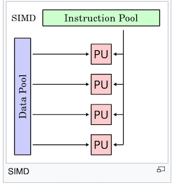
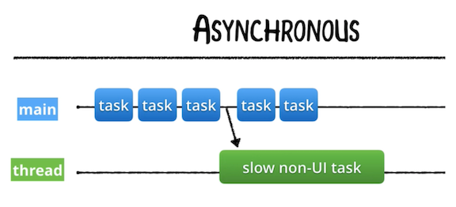
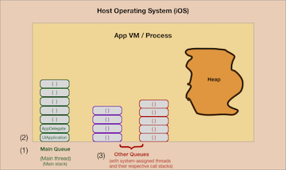

# Grand Central Dispatch (Part 1)

<!-- INSTRUCTOR Notes:

1) for initial exercise, the quiz location is:
https://docs.google.com/document/d/1679wsznKuafup32eV-ae5KQZ6jcx_aIkGY7CQ6ZGp_w/edit

2) xxxx
 -->

## Minute-by-Minute

| **Elapsed** | **Time**  | **Activity**              |
| ----------- | --------- | ------------------------- |
| 0:00        | 0:05      | Objectives                |
| 0:05        | 0:30      | Initial Activity                |
| 0:35        | 0:20      | Overview I                  |
| 0:55        | 0:10      | In Class Activity I       |
| 1:05        | 0:10      | BREAK                     |
| 1:15        | 0:15      | Overview II                  |
| 1:30        | 0:xx      | In Class Activity II      |
| TOTAL       | 1:50      |                           |


## Learning Objectives (5 min)

1. Identify and describe
1. Define
1. Design
1. Implement

## Initial Exercise (30 min)

Discuss as a class...

### Part 1

In the Movie Theatre Game from Lesson 1:

- What physical construct (ie., customer line, casher, etc.) represented: </br>
&nbsp;&nbsp; - A *process*? </br>
&nbsp;&nbsp; - A *thread*? </br>
&nbsp;&nbsp; - A *long-running task*? </br>

- Which aspect of your solution represented: </br>
&nbsp;&nbsp; - Concurrency? </br>
&nbsp;&nbsp; - Parallelism? </br>

### Part 2

Follow up for Lesson 1's Activity 2

### Part 3

1. Review of Concurrency & Parallelism concepts from Lesson 1...

2. **Questions from Last Lesson**:

1) How is it possible to have __*parallelism without concurrency?*__

Let's examine of few of the types of Parallelism...

__*Bit-level Parallelism:*__ Can be thought of as *hardware-based* parallelism.

Historically, 4-bit microprocessors were replaced with 8-bit, then 16-bit, then 32-bit microprocessors, and now 64-bit CPUs, each capable of processing *twice* the number of instructions per cycle as the one before.

Because the number of instructions the system must run to execute a particular task on a 64-bit processor is significantly reduced (compared to previous processors), it can be said that the same number of instructions can now be *executed* in parallel.

However, there is __*no concurrency*__ in this case because it does not involve changes to the *structure* of the executed task.

__*Data Parallelism:*__  &mdash; is parallelism inherent in program loops, which focuses on distributing the __*data*__ across *different computing nodes* to be processed in parallel.

In Data Parallelism, *the same calculation* is performed on *the same* or *different* sets of data.

Example:

A **Single instruction, multiple data (SIMD)** is a class of parallel computers... with multiple processing elements that perform the same operation on multiple data points simultaneously.

Such machines exploit data level parallelism, but not concurrency: there are simultaneous (parallel) computations, but only a single process (instruction) at a given moment.

SIMD is particularly applicable to common tasks such as adjusting the contrast in a digital image or adjusting the volume of digital audio. Most modern CPU designs include SIMD instructions to improve the performance of multimedia use.

In the diagram of a SIMD system below, the same instruction (task) from the Instruction Pool is sent via the four PUs (Processing Units) for execution on the same data object (the Data Pool).

Again, because there is no manipulation of the structure of the task, there is *no concurrency* involved:

&nbsp;&nbsp;&nbsp;&nbsp;&nbsp;  </br>

&nbsp;&nbsp;&nbsp;&nbsp;&nbsp; [Source - wikipedia](https://en.wikipedia.org/wiki/SIMD)

__*Task Parallelism:*__ &mdash; is the characteristic of a parallel program that *entirely different calculations* can be performed on either *the same* or *different* sets of data.

This contrasts with Data Parallelism, where *the same calculation* is performed on *the same* or *different* sets of data.

> Note that __*Concurrency*__ is a type of Task Parallelism where tasks are divided (decomposed) into smaller bits for parallel processing.

### Part 4

And now...

...a small **Quiz**...

<!-- Answers to Quiz:
1)
- B) Concurrency
- E) Thread
- F) Parallelism
- C) Amdahl’s Law
- A) Context Switching (or Time-Slicing)
2)
- Grand_Central_Dispatch
- operations
3) Concurrency = structure
Parallelism = execution
4) (answer can be any 3 of these 5)
- Deadlocks
- Race Conditions
- Readers-Writers Problem
- Thread Explosions
- Priority Inversion
-->

## Overview/TT I (20 min)

### Topics for this Session

- GCD vs Operations
- Dispatch Queues
- FIFO
- Synchronous vs Asynchronous
- The Main Queue
<!-- - Serial vs Concurrent
- QoS Priorities
- Default Queues
- Custom Queues -->

### GCD and Operations (cont'd)

In Lesson 1, we introduced the two Apple-provided APIs you use in iOS to manage concurrent tasks *without* working with threads *directly*: **Grand Central Dispatch (GCD)** and **Operations.**

Before we dive deeper into GCD, let's quickly compare the two to begin your understanding of when and how to use them:

|  Grand Central Dispatch | Operations |
| ------------- | ------------- |
| A *lightweight* way to represent units of work that are going to be executed concurrently. GCD uses **closures** to handle what runs on another thread. |  Operations are **objects** that encapsulate data and functionality. Operations add a little *extra development overhead* compared to GCD. |
| The system takes care of scheduling for you. Adding dependencies, cancelling or suspending code blocks is labor intensive | Allow for greater control over the submitted tasks, including some control over scheduling through adding dependencies among various operations and can re-use, cancel or suspend them.  |
| GCD is good to use for simple, common tasks that need to be run only once and in the background. |  Operations make it easier to do complex tasks. Use them when you need (a) task reusability, (b) considerable communication between tasks, or (c) to closely monitor task execution. |

Apple recommends using the API with the "highest-level of abstraction" (which is Operations), though most developers use a combination of both APIs.

And because Operations are build on top of GCD, it is important to master the lower-level API first...

> *Note: Where Swift uses closures (functions) to handle the code that runs on another thread, C#, Typescript, Python, JavaScript and other languages use the the more common Async/Await pattern. The original plans for Swift 5.0 included adding the Async/Await pattern, but this was removed from the Swift specification until some future release.*

### Why use GCD?

GCD's design improves simplicity, portability and performance.

- It can help you __*improve your app’s responsiveness*__ by deferring computationally expensive tasks from the foreground (`main` thread) to the background (non-UI threads).

- It __*simplifies*__ the creation and the execution of asynchronous or synchronous tasks.

- It’s a concurrency model that is __*much easier to work with__* than locks and threads.

Though GCD still uses threads in its implementation, developers do not have to manage threads themselves.

GCD's tasks are so lightweight to enqueue that Apple, in its 2009 technical brief on GCD, stated that "only 15 instructions are required for implementation, whereas creating traditional threads could require several hundred instructions." <sup>1</sup>

### What does GCD do?

GCD is Apple's implementation of C's `libdispatch` library. It runs directly in the UNIX layer of iOS.

<!-- Its purpose is to queue up tasks — either a function or a closure — that can be run in parallel, depending on availability of resources; it then executes the tasks on an available processor core. -->

GCD works by allowing specific __*tasks*__ &mdash; functions or closures &mdash; that can be run in parallel to be __*queued up*__ for execution and, depending on availability of processing resources, __*schedule*__ them to execute on any of the available processor cores (referred to as "routing" by Apple). <sup>1</sup>

GCD abstracts the notion of threads, and exposes __*dispatch queues*__ to handle __*work items*__ (*work items* are blocks <sup>2</sup> of code that you want to execute). These tasks are assigned (dispatched) to a dispatch queue, which processes them in a __*First-In-First-Out (FIFO)*__ order.

Allowing the `libdispatch` library and the operating system to manage threads means developers have much fewer lines of code to write and less to debug; and the library can optimize thread management behind the scenes much more efficiently than a developer.

> <sup>2</sup> Note: Apple's documentation sometimes refers to a `block` in lieu of a `closure` because `block` was the name used in Objective-C. In the context of concurrency in iOS, you can consider `block` and `closure` interchangeable> [action]

*Sources include:* </br>
- wikipedia
- Apple docs

### Threads, Tasks & DispatchQueues in GCD

Grand Central Dispatch still uses threads at a low level but abstracts them away from the developer.

You work with threads by creating `DispatchQueues`.

__*DispatchQueues*__

In Computer Science, a `queue` is a data structure that manages a collection of objects in FIFO <sup>3</sup> order, where the first object added to the queue is the first object removed from (executed by) the queue.

 <!-- (just like the ticket line at a movie theater and other examples of queues in real-life). -->

&nbsp;&nbsp;&nbsp;&nbsp;&nbsp;&nbsp;&nbsp;&nbsp;&nbsp;&nbsp;&nbsp;&nbsp;&nbsp;&nbsp;&nbsp;&nbsp;&nbsp;&nbsp;&nbsp;&nbsp;&nbsp;&nbsp;  </br>
&nbsp;&nbsp;&nbsp;&nbsp;&nbsp;&nbsp;&nbsp;&nbsp;&nbsp;&nbsp;&nbsp;&nbsp;&nbsp;&nbsp;&nbsp;&nbsp;&nbsp;&nbsp;&nbsp;&nbsp;&nbsp;&nbsp;&nbsp;&nbsp; Photo credit: FreeImages.com/Sigurd Decroos

</br>

In GCD, `DispatchQueue` is a queue object that manages the execution of tasks on your app's `main` thread or on a `background thread`.

It is a FIFO <sup>3</sup> queue to which your application can submit tasks in the form of block objects (functions or closures).

`DispatchQueues`:
- maintain a queue of tasks and execute these tasks, either __*serially or concurrently,*__ in their turn.
- __*hide all thread management*__ related activities. (You can configure a queue, but you won’t interact directly with any thread associated with it.)
- are __*thread safe*__: They can be accessed from different threads simultaneously without locking. (Developers can use `DispatchQueues` to make their own code thread safe.)

Work submitted to `dispatch queues` executes on the *pool of threads* managed by the system.

Except for the dispatch queue (the `main queue`) representing your app's `main thread`, the system makes no guarantees about which thread it uses to execute a task.

__*Thread Pools*__
Thread creation and destruction are expensive processes.

Instead of creating a new thread whenever a task is to be executed, then destroying it when the task finishes, available threads are taken from a pool of available threads created and managed by the operating system ([Thread Pool pattern](https://en.wikipedia.org/wiki/Thread_pool)).

<!-- When you create a `DispatchQueue`, the OS will potentially create and assign one or more threads to the queue. If existing threads are available in the pool, they can be reused; if not, then the OS will create them as needed. -->

&nbsp;&nbsp;&nbsp;&nbsp;&nbsp;&nbsp;&nbsp;&nbsp;&nbsp;&nbsp;&nbsp;&nbsp;&nbsp;&nbsp;&nbsp;  </br>

&nbsp;&nbsp;&nbsp;&nbsp;&nbsp;&nbsp;&nbsp;&nbsp;&nbsp;&nbsp;&nbsp;&nbsp;&nbsp;&nbsp;&nbsp;&nbsp;&nbsp;&nbsp;&nbsp; *A sample thread pool (green boxes) with waiting tasks (blue) and completed tasks (yellow)* </br>
&nbsp;&nbsp;&nbsp;&nbsp;&nbsp;&nbsp;&nbsp;&nbsp;&nbsp;&nbsp;&nbsp;&nbsp;&nbsp;&nbsp;&nbsp;&nbsp;&nbsp;&nbsp;&nbsp; *Source:* https://en.wikipedia.org/wiki/Thread_pool

__*Tasks*__

Tasks in GCD:
- encapsulate code and data into a single object.
- are lightweight, easy to create, and easy to enqueue.
- can be expressed either as a function or as an anonymous "block" of code (eg, a closure).

</br>


<!-- Blocks are an extension to the syntax of C, C++, and Objective-C programming languages that encapsulate code and data into a single object in a way similar to a closure.[11] GCD can still be used in environments where blocks are not available.[15] -->

> <sup>3</sup> FIFO: First In, First Out &mdash; Tasks run in the order in which they are added to the queue — the first task in the queue will be the first to start. Though each block of code will be *started* in the order they were submitted, because more than one code block can be executed at the same time, the order in which tasks *finish* isn't guaranteed.


<!-- A task in Grand Central Dispatch can be used either to create a work item that is placed in a queue or assign it to an event source. If a task is assigned to an event source, then a work unit is made from the block or function when the event triggers, and the work unit is placed in an appropriate queue. This is described by Apple as more efficient than creating a thread whose sole purpose is to wait on a single event triggering. -->


### Synchronous & Asynchronous Tasks

Tasks placed into a queue can either run __*synchronously*__ or __*asynchronously.*__

**Synchronous** &mdash; Submits a task for execution on the current queue and __*returns*__ control to the calling function __*only after*__ that code block (task) finishes executing.

When you schedule a work item (task) __*synchronously,*__ your app will __*wait*__ and __*block*__ the current thread's run loop until execution of the current task finishes, before moving on to the next task.

&nbsp;&nbsp;&nbsp;&nbsp;&nbsp;&nbsp;&nbsp;  </br>

**Asynchronous** &mdash; Schedules a task for __*immediate execution,*__ and __*returns immediately.*__

When you schedule a work item (task) __*asynchronously,*__ that task:
- will be submitted to its queue immediately, but it will also return execution to your app immediately, ordering the submitted task to be executed but *not waiting for it.* This way, the app is free to run other tasks while the submitted task is executing.
- can be *started* (submitted) by one thread but actually *run on a different thread,* taking advantage of additional processor resources to finish their work more quickly.

An asynchronous task (a closure or function) __*does not block*__ the current thread of execution from proceeding on to the next function; your code on the current thread __*does not wait*__ for the submitted task to finish &mdash; it continues executing while the submitted task runs elsewhere.

&nbsp;&nbsp;&nbsp;&nbsp;&nbsp;&nbsp;&nbsp;  </br>


### Creating a Queue


<!-- QUESTION: Should this come AFTER Async/Sync? see Ray W book for clues -->

<!-- TODO: insert code showing how to create a default (serial) queue -->


<!-- TODO: insert code showing how to create a concurrent queue -->

<!-- TODO: explain use of .sync and .async methods -->


<!-- The way you work with threads is by creating a DispatchQueue. When you create a queue, the OS will potentially create and assign one or more threads to the queue. If existing threads are available, they can be reused; if not, then the OS will create them as necessary. -->

When you create a `DispatchQueue`, the OS will potentially create and assign one or more threads to the queue. If existing threads are available in the pool, they can be reused; if not, then the OS will create them as needed.


<!-- Creating a dispatch queue is pretty simple on your part, as you can see in the example below: -->

<!-- Normally, you'd put the text of the label directly inside the initializer, but it's broken into separate statements for the sake of brevity. -->

```Swift
  let myQueue = DispatchQueue(label: "com.makeschool.mycoolapp.networking")
 ```

The `label:` argument needs to be a unique identifier. The example above illustrates the preferred practice of using a reverse-DNS name (eg, com.your_company.your_app) to guarantee uniqueness (you could also use a UUID).

And because the `label:` helps immensely when debugging, it is a good idea to assign it text that is meaningful to you (ie, the ".networking" token above).

## In Class Activity I (10 min)

GCDPlay.playground

[GCDPlay.playground]()

<!-- TODO: add link to GCDPlay.playground -->

**TODO:**
1. run the `GCDPlay.playground` and observe its output

**Q:** What can you infer about the order in which the 2 `for loops` execute?

**Q:** On what queue does the following `for loop` run?

```Swift  
  for i in 100..<110 {
      print("🐳 ", i)
  }

```

2. Currently, the playground runs the `.sync` function on the queue labeled `"com.makeschool.queue"`
- change `.sync` to `.async` and run the playground again

**Q:** How has the output changed after changing `.sync` to `.async`? (ie, in what order do the `for loops` execute now?)

```Swift
  import Foundation

  let queue = DispatchQueue(label: "com.makeschool.queue")

  queue.sync {
      for i in 0..<10 {
          print("🍎 ", i)
      }
  }

  for i in 100..<110 {
      print("🐳 ", i)
  }
 ```


 <!-- TODO: add another example exercise

  - see previous Lesson Plans for suitable playgrounds

 -->


## Overview/TT II (optional) (20 min)


### The Main queue


When your app starts, a main dispatch queue is automatically created for you. It's a serial queue that's responsible for your UI. Because it's used so often, Apple has made it available as a class variable, which you access via DispatchQueue.main. You never want to execute something synchronously against the main queue, unless it's related to actual UI work. Otherwise, you'll lock up your UI which could potentially degrade your app performance.


<!-- TODO: insert example of delegating back to main queue here -->


<!-- Introduce Deadlock

show diagram  -->

Important
Attempting to synchronously execute a work item on the main queue results in deadlock.


<!-- from Ray W --  Note: You should never perform UI updates on any queue other than the main queue. If it's not documented what queue an API callback uses, dispatch it to the main queue! -->


 </br>


#### Calling Sync on Current Queue

< never call Sync on main queue >


#### Calling xxxx


When designing tasks for concurrent execution, do not call methods that block the current thread of execution. When a task scheduled by a concurrent dispatch queue blocks a thread, the system creates additional threads to run other queued concurrent tasks. If too many tasks block, the system may run out of threads for your app.

Another way that apps consume too many threads is by creating too many private concurrent dispatch queues. Because each dispatch queue consumes thread resources, creating additional concurrent dispatch queues exacerbates the thread consumption problem. Instead of creating private concurrent queues, submit tasks to one of the global concurrent dispatch queues. For serial tasks, set the target of your serial queue to one of the global concurrent queues. That way, you can maintain the serialized behavior of the queue while minimizing the number of separate queues creating threads.


https://developer.apple.com/documentation/dispatch/dispatchqueue


<!-- TODO: Ask questions:
- what would happen if the system (a) runs out of threads, and/or (b) creating too many queues? (hint: are queues limited by cores?)
 -->


#### Serial Queues


A client to the library may also create any number of serial queues, which execute tasks in the order they are submitted, one at a time.

Because a serial queue can only run one task at a time, each task submitted to the queue is critical with regard to the other tasks on the queue, and thus a serial queue can be used instead of a lock on a contended resource.


Serial queues only have a single thread associated with them and thus only allow a single task to be executed at any given time.

<!-- TODO: insert graphic here -->


#### concurrent queues

	- requires QoS Priority

 A concurrent queue, on the other hand, is able to utilize as many threads as the system has resources for. Threads will be created and released as necessary on a concurrent queue.


<!-- from Ray W --  Note: While you can tell iOS that you'd like to use a concurrent queue, remember that there is no guarantee that more than one task will run at a time. If your iOS device is completely bogged down and your app is competing for resources, it may only be capable of running a single task. -->

<!-- TODO: insert graphic here -->

-- Asynchronous doesn't mean concurrent


<!-- from Ray W --  
While the difference seems subtle at first, just because your tasks are asynchronous doesn't mean they will run concurrently. You're actually able to submit asynchronous tasks to either a serial queue or a concurrent queue. Being synchronous or asynchronous simply identifies whether or not the queue on which you're running the task must wait for the task to complete before it can spawn the next task.

On the other hand, categorizing something as serial versus concurrent identifies whether the queue has a single thread or multiple threads available to it. If you think about it, submitting three asynchronous tasks to a serial queue means that each task has to completely finish before the next task is able to start as there is only one thread available.

In other words, a task being synchronous or not speaks to the source of the task.

Being serial or concurrent speaks to the destination of the task.
-->

##### QoS levels


The library automatically creates several queues with different priority levels that execute several tasks concurrently, selecting the optimal number of tasks to run based on the operating environment.

Concurrent queues are so common that Apple has provided six different global concurrent queues, depending on the Quality of service (QoS) the queue should have.

<!-- TODO: insert table here -->


#### Default Queues


#### Custom Queues


## In Class Activity II (optional) (30 min)

<!-- TODO: create this...is there a suitable playground from prior lesson?
- set up a situation where students call sync on current queue
 -->


## After Class
1. Research:
- `DispatchObject`
- `DispatchWorkItem`
- `dispatchMain()`

2. Assignment:
-
<!-- TODO: have students to the Ray W tute on Concurrency -->


## Wrap Up (5 min)

- Continue working on your current tutorial
- Complete reading
- Complete challenges

## Additional Resources

1. [Slides]()
2. [Grand_Central_Dispatch - wikipedia](https://en.wikipedia.org/wiki/Grand_Central_Dispatch) <sup>1</sup>
3. [Async/await - wikipedia](https://en.wikipedia.org/wiki/Async/await)
4. [Coroutine - wikipedia](https://en.wikipedia.org/wiki/Coroutine)
5. []()

8.


https://gist.github.com/lattner/429b9070918248274f25b714dcfc7619


https://developer.apple.com/documentation/dispatch/dispatchqueue
