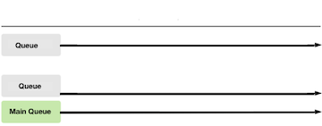
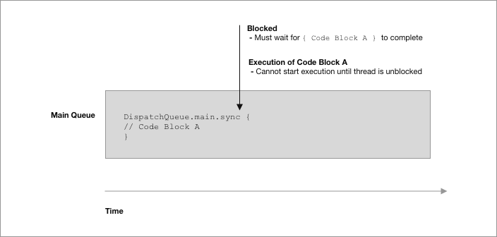

# Grand Central Dispatch (Part 2)

<!-- INSTRUCTOR Notes:

1) for initial exercise...
- answers to Part 2 are below each question...

2) xxxx
 -->


## Minute-by-Minute

| **Elapsed** | **Time**  | **Activity**              |
| ----------- | --------- | ------------------------- |
| 0:00        | 0:05      | Objectives                |
| 0:05        | 0:20      | Initial Exercise                  |
| 0:25        | 0:25      | Overview I                 |
| 0:50        | 0:45      | In Class Activity I       |
| 1:05        | 0:10      | BREAK                     |
| 1:15        | 0:45      | In Class Activity II      |
| TOTAL       | 2:00      |                           |

## Why you should know this or industry application (optional) (5 min)

Explain why students should care to learn the material presented in this class.

## Learning Objectives (5 min)

By the end of this lesson, you should be able to...

<!-- 1. Identify and describe:
- Apple's 2 APIs for managing Concurrency - __*Grand Central Dispatch*__ and __*Operations*__
- __*queues*__ and __*dispatch queues*__
- __*FIFO*__ Queues
- __*Synchronous*__ and __*Asynchronous*__ tasks
- the lifecycle and other attributes of the __*Main Queue*__
2. How to implement:
- basic examples of __*dispatch queues*__ running built-in `.sync` and `.async` functions -->


## Initial Exercise (20 min)

### Part 1 &mdash; Diagramming Concurrent Task Execution

#### Individually - Diagram

**Scenario:**
- Your app fetches images from the Internet, then processes them for display through a sepia tone filter.
- Fetching and processing images is negatively impacting performance, especially scrolling in the table view.

**TODO:**
Diagram how you would use what you know so far about currency in iOS to improve your app's performance. In your diagram, be sure to point out:

1. the point in time on the relevant queue(s) where an image is downloaded
2. the point where the image is filtered
3. the point at which the image is presented to the user, and the queue on which this would take place

&nbsp;&nbsp;&nbsp;&nbsp;&nbsp;&nbsp;&nbsp;  </br>

### Part 2 &mdash; Calling main.sync from Background Thread

Let's examine the code in the snippet below:

```Swift  
  func someFunction() {
    DispatchQueue.global().async {  // A) Run the following code block asynchronously on a non-UI thread
          let url = URL(string: imageUrl)
          do {
              let data = try Data(contentsOf: url!)
                  DispatchQueue.main.sync { // B) Run the code below synchronously on the main queue
                      self.imageIcon.image = UIImage(data: data)
                  }
              }
    }
  ```

**Q:** What exactly is happening in this code?

<!-- At point `A)`, the code runs asynchronously on a background thread and &mdash; when done &mdash; it calls the `main queue` and tells it to run the code at `B)` *immediately* next (synchronously); in other words, it submits the block to the `main queue` and `.sync` tells the `main queue` to run the block immediately after the current function (`someFunction()`) completes (but after any system tasks already in the `main queue` have run). -->

**Q:** When might this be useful?

<!-- in `viewDidLoad()`, for example - updating the image immediately after the `viewDidLoad()` function runs, rather than allowing some other function in the ViewController to execute, might enhance the user experience... -->


*Source:* https://www.reddit.com/r/iOSProgramming/comments/7n9e9f/what_is_the_difference_between/


## Overview/TT I (20 min)


<!-- REVIEW OF SYNC AND ASYNC FRM LAST CLASS?
In synchronous execution by sync method the current thread waits until the task finished before the method call returns. In asynchronous execution by async method, the method call returns immediately. Never call sync method in the main queue which will cause deadlock of the app. -->


<!-- Asynchronous tasks are started by one thread but actually run on a different thread, taking advantage of additional processor resources to finish their work more quickly. (from Apple ) -->


<!-- When NOT to use synchronous

when to use sync  -->


<!-- A synchronous function returns control to the caller after the task is completed.
An asynchronous function returns control to the caller immediately, ordering the task to be done but not waiting for it.
Thus, an asynchronous function does not block the current thread of execution from proceeding on to the next function. -->


### When to use Async?

In asynchronous execution by the `.async` method, the method call returns immediately, ordering the task to be done but not waiting for it to finish.

Asynchronous tasks are started by one thread but actually run on a different thread, taking advantage of additional processor resources to finish their work more quickly.

*from:* Apple docs

Use `.async` when your app does __*not*__ need to wait until the operation inside the block is finished.

As mentioned, **long-running tasks** such as image/data processing, local or remote data fetching, and other network calls are typically good candidates for running tasks `.async`.

If the `viewDidLoad()` method of your `View Controller` has too much work to do on the `main queue`, this can often result in long wait times before the view appears. If possible, it’s best to offload some work to be done in the background using `.async`, if it’s not absolutely essential at load time for the view.

### When to use Sync?

In synchronous execution by `.sync` method, the current thread waits until the task is finished before the method call returns.

Use `.sync` when your app needs to wait until a task is finished.

Example scenarios include:
- to ensure a particular function is not called a second time before its first invocation is finished.
- to wait for an operation inside a block to finish before you can use the data processed by the block.


### Sync and Deadlocks

#### Never Call .sync on Current Queue

__*Do not call*__ the `dispatch_sync` (aka, `.sync`) function from a task that is executing on the same queue that you pass to your function call. Doing so will **deadlock** the queue.

If you need to dispatch to the current queue, __*do so asynchronously*__ using the `dispatch_async` (`.async`) function.

*Source: Apple docs*

#### Deadlock

A **deadlock** occurs when two or more tasks are waiting on each other to finish and get stuck in a never-ending cycle. Neither can proceed until the other completes; but, since neither can proceed, neither will finish.

A **deadlock** can occur even when the perpetually-waiting tasks are on the same thread.

> *We'll see an example of a deadlock a bit later in this lesson....*

<!-- &nbsp;&nbsp;&nbsp;&nbsp;&nbsp;&nbsp;&nbsp;  </br> -->


### The Main queue

When your app starts, a `main` dispatch queue is automatically created for you.

The `main queue`:
- is a *serial queue* that's responsible for your UI. (We'll cover *serial* and *concurrent* queues in the next lesson.)
- is closely associated with the `main thread` and its call stack. The `main queue` *only* executes code on the `main thread`.

> REMEMBER: You should __*never*__ perform UI updates on any queue other than the `main queue`. And you must always access UI Kit classes on the `main thread`.

#### How the Main Queue Fits

Our updated diagram of the structure inside the runtime process of an iOS app simply illustrates that the `main queue` is associated directly with the `main thread` and its call stack, and that the system also creates queues for non-UI tasks.

(1) When an iOS app starts, the system automatically creates the app's:
- `main queue`
- `main thread`
- and the corresponding call stack that the `main thread` manages.

(2) The `main thread`, again, allocates your app's `Application` object in its stack frame, which in turn executes its delegate methods on its AppDelegate object in their respective stack frames, and so on...

<!-- But unless specified otherwise, all non-UI code will also execute on the main thread (exceptions to this include frameworks such as URLSession in which some tasks run on non-UI threads by default). -->

(3) Notice that, though the system also creates a pool of additional threads for potential non-UI tasks and their corresponding call stacks, what actually happens is here is that __*additional dispatch queues*__ are created (to which the system will assign a thread from the pool, as needed):

&nbsp;&nbsp;&nbsp;&nbsp;&nbsp;&nbsp;&nbsp;  </br>

#### DispatchQueue.main (class variable)
Because it's used so often, Apple has made it available as a class variable, which you access via `DispatchQueue.main`.

Example showing `.async` called on the built-in `DispatchQueue.main` property:

```Swift  
  import Foundation

  var value: Int = 2

  DispatchQueue.main.async {
      for i in 0...3 {
          value = i
          print("\(value) ✴️")
      }
  }

  for i in 4...6 {
      value = i
      print("\(value) ✡️")
  }

  DispatchQueue.main.async {
      value = 9
      print(value)
  }
```

#### Concurrency and the Main Queue

In general, look for opportunities to take long-running, non-UI task and run them asynchronously on a queue other than the `main queue`.

The **pseudocode example** below illustrates the typical steps to running a non-UI tasks asynchronously on a background queue/thread:
1. create a queue
2. submit a task to it to run asynchronously
3. when it is complete, you redirect control flow back to the `main thread` to update the UI.

```Swift  
  // Somewhere inside a class...
  let queue = DispatchQueue(label: "com.makeschool.queue")

  // Somewhere in your function
  queue.async {
    // Call slow non-UI methods here
    DispatchQueue.main.async {
      // Update the UI here
    }
  }
```

<!-- Note: It's important to keep in mind that, while the queues are FIFO based, that does not ensure that tasks will finish in the order you submit them. The FIFO procedure applies to when the task starts, not when it finishes. -->


#### Never Call .sync on the Main Queue

Just as with the current queue, you never want to execute a code block __*synchronously*__ against the `main queue` either. Doing so could cause your app to crash or it might simply degrade your app's performance by locking your UI.

For example, this statement:

```Swift  
  DispatchQueue.main.sync {
    // Some synchronous code block
  }
```

...will cause the following events:
1. `sync` queues the block in the `main queue`.
2. `sync` blocks the thread of the `main queue` until the block finishes executing.
3. but `sync` will wait forever because the thread where the block is intended to run is blocked. The submitted code block will not even start until the thread is unblocked, and the thread can't be unblocked until that same code block completes.

In the diagram below:
- A code block identified as `Code Block A` was submitted __*synchronously*__ to the `Main Queue`.
- At the point in which `DispatchQueue.main.sync` is called, the `Main Queue` is blocked awaiting the completion of the code block (`Code Block A`) which called `.sync`.
- But `Code Block A` __*cannot even start*__ executing until the `Main Queue` is unblocked.

 </br>

The key to understanding this is that `.sync` does not __*execute*__ tasks/blocks, it only __*queues*__ them. Execution will happen on a future iteration of the run loop. If the thread is blocked until some condition occurs (i.e., some block of code completes), no future iteration of the run loop can occur that condition is met and the queue and its thread are unblocked.  

*Source:* https://medium.com/swift-india/parallel-programming-with-swift-part-1-4-df7caac564ae


## Overview/TT II (20 min)

<!-- OUTLINE:
- Key Concepts
- Serial & Concurrent Qs
- 3 Types of queues
- QoS
- Inferring QoS
- Async Does NOT mean concurrent -->


### Key Concepts

Before we delve deeper into GCD's `DispatchQueues`, let's explore a couple of related concepts...

#### Critical Section

Multiple, concurrent accesses to shared resources can lead to unexpected or erroneous behavior. So, parts of the program where the shared resource is accessed are protected from concurrent access.

This protected section is called the **critical section** (or **critical region**).

The code in the **critical section**:
- accesses shared variables/resources and has to be executed as an __*atomic*__ action.
- should not be executed by more than one process at a time.

Typically, the critical section accesses a shared resource &mdash; such as a data structure, a peripheral device, or a network connection &mdash; that would not operate correctly in the context of multiple concurrent accesses.

For example, a critical section might manipulate a particular variable that can become corrupt if it is accessed by concurrent processes.

In the diagram below, if `Process 1` executes the code in the Critical Section to read a shared variable &mdash; while `Process 2` needs to write to the same variable &mdash;  `Process 1` might get either the old or new value of the variable:

&nbsp;&nbsp;&nbsp;&nbsp;&nbsp;&nbsp;  </br>


**Examples:**

1. Classic Example &mdash; A bank account shared by two people.

If `Person 1` checks the account balance at the same time that `Person 2` executes some transaction (eg., withdraws money), that transaction may not be reflected in the balance that `Person 1` sees.

To ensure the balance reported is always accurate, any code accessing the variable holding the balance can be protected from concurrent access.

2. A shared document.

When two or more people are updating a shared document, access to the document can be temporarily limited to each active contributor &mdash; even if only for an instance &mdash; to prevent additional contributors from making changes before the doc is autosaved.

&nbsp;&nbsp;&nbsp;&nbsp; *Sources:* </br>
&nbsp;&nbsp;&nbsp;&nbsp;&nbsp;&nbsp; - Apple </br>
&nbsp;&nbsp;&nbsp;&nbsp;&nbsp;&nbsp; - wikipedia


#### Thread Safety

Thread Safe
Thread safe code can be safely called from multiple threads or concurrent tasks without causing any problems (data corruption, crashing, etc).

Code that is not thread safe must only be run in one context at a time. An example of thread safe code is NSDictionary. You can use it from multiple threads at the same time without issue. On the other hand, NSMutableDictionary is not thread safe and should only be accessed from one thread at a time.


### DispatchQueues (cont'd)


Queues can be either serial or concurrent.

- FIFO
- Thread Safe

The decision of when to start a task is entirely up to GCD.
If the execution time of one task overlaps with another, it’s up to GCD to determine if it should run on a different core, if one is available, or instead to perform a context switch to run a different task.


#### Serial Queues

<!-- Serial queues guarantee that only one task runs at any given time.
GCD controls the execution timing.
You won’t know the amount of time between one task ending and the next one beginnin -->


<!-- A client to the library may also create any number of serial queues, which execute tasks in the order they are submitted, one at a time. -->

Because a serial queue can only run one task at a time, each task submitted to the queue is critical with regard to the other tasks on the queue, and thus a serial queue can be used instead of a lock on a contended resource.


Serial queues only have a single thread associated with them and thus only allow a single task to be executed at any given time.


<!-- TODO: note that main queue is a serial queue  -->
<!-- When your app launches, the system automatically creates a serial queue and binds it to the application’s main thread. All UI tasks have to be run on the main thread. -->
<!-- When user runs app, the system automatically creates a serial dispatch queue which runs app’s main thread. This is called main queue, and task assigned in this queue works one at a time serially. To access in the code:

let mainQueue   = DispatchQueue.main -->

<!-- TODO: insert graphic here -->


<!-- TODO: insert code showing how to create a default (serial) queue -->


<!-- TODO: insert code showing how to create a concurrent queue -->


Since no two tasks in a serial queue can ever run concurrently, there is no risk they might access the same critical section concurrently; that protects the critical section from race conditions with respect to those tasks only. So if the only way to access that critical section is via a task submitted to that dispatch queue, then you can be sure that the critical section is safe.


#### concurrent queues

 A concurrent queue, on the other hand, is able to utilize as many threads as the system has resources for. Threads will be created and released as necessary on a concurrent queue.


 <!-- Concurrent queues allow multiple tasks to run at the same time.
 Tasks are guaranteed to start in the order they were added.
 Tasks can finish in any order and
 you have no knowledge of the time it will take for the next task to start, nor the number of tasks that are running at any given time. -->


	- requires QoS Priority


<!-- from Ray W --  Note: While you can tell iOS that you'd like to use a concurrent queue, remember that there is no guarantee that more than one task will run at a time. If your iOS device is completely bogged down and your app is competing for resources, it may only be capable of running a single task. -->

<!-- TODO: insert graphic here -->


##### Types of Queues

<!-- Provided by GCD

- Main Queue
- Global (Concurrent Queues)
  - require QoS Priority
- Custom Queues - Serial or Concurrent -->

##### QoS levels


<!-- Concurrent queues are so common that Apple has provided six different global concurrent queues, depending on the Quality of service (QoS) the queue should have. -->

The library automatically creates several queues with different priority levels that execute several tasks concurrently, selecting the optimal number of tasks to run based on the operating environment.


<!-- TODO: insert table here -->


##### Inferring QoS priority


##### Asynchronous doesn't mean concurrent

<!-- TODO: Async does NOT mean concurrent -->

<!-- from Ray W --  
While the difference seems subtle at first, just because your tasks are asynchronous doesn't mean they will run concurrently. You're actually able to submit asynchronous tasks to either a serial queue or a concurrent queue. Being synchronous or asynchronous simply identifies whether or not the queue on which you're running the task must wait for the task to complete before it can spawn the next task.

On the other hand, categorizing something as serial versus concurrent identifies whether the queue has a single thread or multiple threads available to it. If you think about it, submitting three asynchronous tasks to a serial queue means that each task has to completely finish before the next task is able to start as there is only one thread available.

In other words, a task being synchronous or not speaks to the source of the task.

Being serial or concurrent speaks to the destination of the task.
-->


## In Class Activity I (20 min)


<!-- There are four predefined global concurrent queues
< list them …that’s all >
Activity - < send them to place to read about the queues>
break into teams (4 teams of 3)
< need 4 empty slides >
each team would fill in their respective slide decks -->


## Overview/TT III (20 min)

### Creating Serial & Concurrent Queues


< recall from previous lesson >
It's easy to create a `DispatchQueue`. This example creates a new `DispatchQueue` called `myQueue` with a *label* (identifier) of `"com.makeschool.mycoolapp.networking"`:

```Swift
  let myQueue = DispatchQueue(label: "com.makeschool.mycoolapp.networking")
 ```

<!-- The default initializer, as shown in the code above, will create a serial queue wherein each task must complete before the next task is able to start. -->


<!-- In order to create a concurrent queue, simply pass in the .concurrent attribute, like so: -->

```Swift
  let myQueue = DispatchQueue(label: "com.makeschool.mycoolapp.networking", attributes: .concurrent)
 ```


#### Custom Queues


#### Default Queues


#### Issues


<!-- TODO: introduce Thread Explosion? -->
 <!-- Many workitems submitted to global concurrent queue
 If workitems block, more threads will be created
 May lead to thread explosion -->


Another way that apps consume too many threads is by creating too many private concurrent dispatch queues. Because each dispatch queue consumes thread resources, creating additional concurrent dispatch queues exacerbates the thread consumption problem. Instead of creating private concurrent queues, submit tasks to one of the global concurrent dispatch queues. For serial tasks, set the target of your serial queue to one of the global concurrent queues. That way, you can maintain the serialized behavior of the queue while minimizing the number of separate queues creating threads.

https://developer.apple.com/documentation/dispatch/dispatchqueue


<!-- TODO: Ask questions:
- what would happen if the system (a) runs out of threads, and/or (b) creating too many queues? (hint: are queues limited by cores?)
 -->


 > Note &mdash; When designing tasks for concurrent execution, do not call methods that block the current thread of execution. When a task scheduled by a concurrent dispatch queue blocks a thread, the system creates additional threads to run other queued concurrent tasks. If too many tasks block, the system may run out of threads for your app.

 https://developer.apple.com/documentation/dispatch/dispatchqueue


## In Class Activity II (20 min)

<!-- TODO: create this...is there a suitable playground from prior lesson?
- set up a situation where students call sync on current queue?
 -->


## After Class
1. Research:
- Dining philosophers problem
- the critical section problem

2. Assignment:
-

<!-- TODO: do Ray W tutorial? -->


## Wrap Up (5 min)

- Continue working on your current tutorial
- Complete reading
- Complete challenges

## Additional Resources

1. [Slides]()
2. []()
3. []()
4. []()
5. []()


https://developer.apple.com/videos/play/wwdc2017/706/

https://en.wikipedia.org/wiki/Critical_section

https://developer.apple.com/documentation/foundation/nslocking/1416318-lock


https://en.wikipedia.org/wiki/Peterson%27s_algorithm
