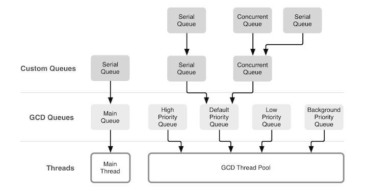

# Grand Central Dispatch (Part 3)

<!-- INSTRUCTOR Notes:

1) for initial exercise...
- answers to Part 2 are below each question...

2) for Activity 1:
- instructor notes are below exercise...
 -->

## Minute-by-Minute

| **Elapsed** | **Time**  | **Activity**              |
| ----------- | --------- | ------------------------- |
| 0:00        | 0:05      | Objectives                |
| 0:05        | 0:10      | Initial Exercise           |

| 0:15        | 0:20      | Overview / TT I                 |
| 0:20        | 0:45      | In Class Activity I       |
| 1:05        | 0:10      | BREAK                     |
| 0:05        | 0:15      | Overview / TT II              |

| 1:15        | 0:45      | In Class Activity II      |
| TOTAL       | 2:00      |                           |

## Why you should know this or industry application (optional) (5 min)

Explain why students should care to learn the material presented in this class.

## Learning Objectives (5 min)
By the end of this lesson, you should be able to...

1. Identify and describe:
<!-- - when to use __*Synchronous*__ and __*Asynchronous*__
- __*Sync*__ and __*Deadlocks*__
- __*Critical Section*__
- __*Thread Safety*__
- GCD's provided __*serial*__ and __*concurrent*__ DispatchQueues
- __*QoS Priority*__
- how the __*Main Queue*__ fits in GCD -->

2. Implement

## Initial Exercise (10 min)

### Part 1 - As A Class

- Highlights of WWDC 2019 so far...

### Part 2 - As A Class

- Review of GCD subtopics and questions from previous class...

&nbsp;&nbsp;&nbsp;&nbsp;  </br>

&nbsp;&nbsp;&nbsp;&nbsp;&nbsp;&nbsp;&nbsp; *Source:*
&nbsp;&nbsp;&nbsp;&nbsp;&nbsp;&nbsp;&nbsp; https://www.objc.io/issues/2-concurrency/concurrency-apis-and-pitfalls/

## Overview/TT I (20 min)

<!-- OUTLINE:

Inferring QoS
Creating Serial & Concurrent Queues
Custom queues
Default Queues
Issues

Delaying Work with dispatch_after?
Handling Background Tasks with dispatch_sync?
Making Your Singletons Thread-Safe? -->


### Creating Serial & Concurrent Queues


<!-- TODO: Insert big graphic from old slide deck showing how Serial, Concurrent and QoS stacks up -->


<!-- TODO: insert code showing how to create a default (serial) queue -->


<!-- TODO: insert code showing how to create a concurrent queue -->

< recall from previous lesson >
It's easy to create a `DispatchQueue`. This example creates a new `DispatchQueue` called `myQueue` with a *label* (identifier) of `"com.makeschool.mycoolapp.networking"`:

```Swift
  let myQueue = DispatchQueue(label: "com.makeschool.mycoolapp.networking")
 ```

<!-- The default initializer, as shown in the code above, will create a serial queue wherein each task must complete before the next task is able to start. -->


<!-- In order to create a concurrent queue, simply pass in the .concurrent attribute, like so: -->

```Swift
  let myQueue = DispatchQueue(label: "com.makeschool.mycoolapp.networking", attributes: .concurrent)
 ```


##### QoS Priority (quick review / revisited )

<!-- TODO: insert QoS levels enum here -->


<!-- TODO: insert table here, with the 2 add'l QoS levels from Ray W bk -->


<!-- IDEAS FROM RAY W: - TODO: 1) check these against prior lesson for redundancy 2) boil down
Concurrent queues are so common that Apple has provided six different global concurrent queues, depending on the Quality of service (QoS) the queue should have.

When using a concurrent dispatch queue, you'll need to tell iOS how important the tasks are that get sent to the queue so that it can properly prioritize the work that needs to be done against all the other tasks that are clamoring for resources. Remember that higher-priority work has to be performed faster, likely taking more system resources to complete and requiring more energy than lower-priority work.
If you just need a concurrent queue but don't want to manage your own, you can use the global class method on DispatchQueue to get one of the pre-defined global queues:

let queue = DispatchQueue.global(qos: .userInteractive)

As mentioned above, Apple offers six quality of service classes:

Note: Global queues are always concurrent and first-in, first-out. -->

<!-- TODO: insert code showing how to create a queue with QoS levels -->


##### Inferring QoS priority

<!-- TODO:

- review Ray W bk for clues

- google Apple, etc., for more details
 -->


#### Custom Queues


#### Default Queues


#### Issues


<!-- TODO: introduce Thread Explosion? -->
 <!-- Many workitems submitted to global concurrent queue
 If workitems block, more threads will be created
 May lead to thread explosion -->


Another way that apps consume too many threads is by creating too many private concurrent dispatch queues. Because each dispatch queue consumes thread resources, creating additional concurrent dispatch queues exacerbates the thread consumption problem. Instead of creating private concurrent queues, submit tasks to one of the global concurrent dispatch queues. For serial tasks, set the target of your serial queue to one of the global concurrent queues. That way, you can maintain the serialized behavior of the queue while minimizing the number of separate queues creating threads.

https://developer.apple.com/documentation/dispatch/dispatchqueue


<!-- TODO: Ask questions:
- what would happen if the system (a) runs out of threads, and/or (b) creating too many queues? (hint: are queues limited by cores?)
 -->


 > Note &mdash; When designing tasks for concurrent execution, do not call methods that block the current thread of execution. When a task scheduled by a concurrent dispatch queue blocks a thread, the system creates additional threads to run other queued concurrent tasks. If too many tasks block, the system may run out of threads for your app.

 https://developer.apple.com/documentation/dispatch/dispatchqueue


<!-- explain Thread Explosion? here?
- see my notes in "Problems with Concurrency & Shared Memory" doc
- google more examples -->


## In Class Activity I (20 min)

<!-- TODO: create this...is there a suitable playground from prior lesson?
- set up a situation where students call sync on current queue?
 -->


## In Class Activity I (30 min)

- I do, We do, You do
- Reading & Discussion Questions in small groups
- Draw a picture/diagram
- Complete Challenges solo or in pair
- Q&A about tutorials
- Pair up and code review
- Pair program
- Formative assessment
- Form into groups
- etc (get creative :D)

## Overview/TT II (optional) (20 min)

## In Class Activity II (optional) (30 min)

## After Class
1. Research:
- Thunk
-
2. Assignment:
-

## Wrap Up (5 min)

- Continue working on your current tutorial
- Complete reading
- Complete challenges

## Additional Resources

1. [Slides]()
2. []()
3. []()
4. []()
5. []()
