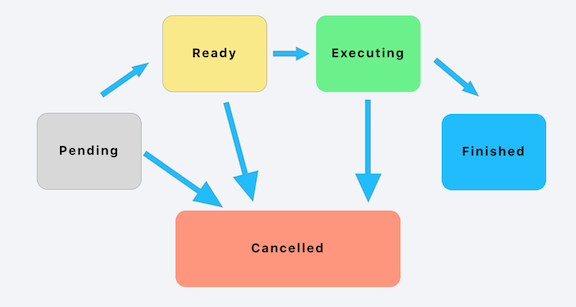

# Operations (Part 1)

## Minute-by-Minute

| **Elapsed** | **Time**  | **Activity**              |
| ----------- | --------- | ------------------------- |
| 0:00        | 0:05      | Objectives                |
| 0:05        | 0:20      | Intro to Operations (TT I)                  |
| 0:20        | 0:45      | In Class Activity I       |
| 1:05        | 0:10      | BREAK                     |
| 1:15        | 0:45      | In Class Activity II      |
| TOTAL       | 2:00      |                           |

## Why you should know this

From the start of this course, we've called out that Grand Central Dispatch (GCD) and Operations are the two built-in APIs from Apple that you use in iOS to manage concurrent tasks (as opposed to working with threads directly).

We have also mentioned that...

- Both technologies are designed to encapsulate units of work and dispatch them for execution.
- Operations are build on top of GCD.
- Apple advises developers to use the highest level of abstraction that is available (which is Operations).
- Most developers implement a combination of GCD and Operations, depending on which suits their specific requirements.

But Operations are not without their own challenges and pitfalls.

As a developer, you need to know:

- The benefits Operations offer &mdash; as well as their challenges and pitfalls.
- The differences between GCD and Operations.
- Under which circumstances might Operations be a better solution than GCD.

## Learning Objectives (5 min)

1. Identify and describe
1. Define
1. Design
1. Implement

<!-- Define and describe:
- Operation
- Operation Queues
- Benefits and Challenges of using Operations and Operation Queues
- the difference between GCD and Operations and Operation Queues
- when to use GCD vs Operations vs Operation Queues
- Subclassing
- Block Operations -->

## Initial Exercise (15 min)

Review solutions to *Assignment 2: Solve the Dining Philosophers Problem (challenge)* from previous class:
https://github.com/raywenderlich/swift-algorithm-club/tree/master/DiningPhilosophers

- One or more volunteers present their solutions. Opens a class discussion.

## Intro to Operations (20 min)

### What are they?
`Operation` (formerly called `NSOperation`) is a class that allows you to encapsulate (wrap) a unit of work into a package you can execute at some time in the future.

`Operation` is an __*abstract*__ class that represents the code and data associated with a single task.

Key attributes of Operations:
- An Operation describes a single unit of work
- A higher level of abstraction over GCD
- Object-oriented (vs functions/closures in GCD)
- Execute concurrently &mdash; but can be serial by using dependencies
- Offer more developer control (than GCD)

### Why use them?
The Operation class offers a number of compelling benefits over GCD:

**Dependencies**  
Dependencies enables developers to execute tasks in a specific order.

By default, an operation object with dependencies is not considered ready until all of its dependent operation objects have finished executing. Once the last dependent operation finishes, the operation object becomes ready and able to execute.

**KVO-Compliant**  
`Operation` and `OperationQueue` classes have a number of properties that can be observed using KVO (Key Value Observing).

This allows you to monitor the *state* 1 of an operation or operation queue.

**Developer Control**  
Using GCD, once you dispatch a task, you no longer have control or insight into the execution of that task.

The `Operation` and `OperationQueue` classes are more flexible in that respect, giving the developer control over the operation's life cycle:

- **Max Number of Operations** &mdash; For an `OperationQueue`, you can specify the __*maximum number of queued operations*__ that can run simultaneously. This makes it easy to (a) control how many operations run at the same time or (b) to create a serial operation queue.

- **Execution Priority Levels** &mdash; For subclasses of `Operation`, you can configure the __*execution priority*__ level of an operation in an operation queue. 1

- **Pause, Resume, Cancel** &mdash; `Operations` can also be __*paused, resumed, and cancelled.*__

1 *Details on operation state, KVO properties, and priority levels coming up later...*

### How do Operations work?
Because the Operation class is an abstract class, you do not use it directly. Instead, you subclass it or use one of the system-defined subclasses (`NSInvocationOperation` or `BlockOperation`) to perform the actual task.

There are two ways to execute operations:

**Operation Queues** &mdash; Typically, you execute operations by submitting them to an operation queue &mdash; an instance of the `OperationQueue` class &mdash; to be processed based on the priority of each operation submitted.

An operation queue executes its operations either __*directly*__ &mdash; by running them on secondary threads &mdash; or __*indirectly*__ using the `libdispatch` library (aka, GCD).

> *More on OperationQueues coming up...*

**Start method** &mdash; You can also choose *not* to use an `OperationQueue` and execute an operation yourself by calling its `start()` method directly from your code.

Because starting an operation that is not in the ready state triggers an exception, executing operations manually puts additional burden on your code to handle state changes if you choose to call an operation's `start()` method directly yourself.

> *Note that later we'll see that the `isReady` property reports on the operation’s readiness.*

**Some things to note**

1. An operation object is a "single-shot object" &mdash; that is, it executes its task once and cannot be used to execute it again.
2. Unlike GCD, operations run __*synchronously*__ by default &mdash; that is, they perform their task in the thread that calls their `start()` method. (You can get them to run asynchronously, but this requires much more work.)
3. Despite being abstract, the base implementation of `Operation` includes significant logic to coordinate the safe execution of your task.
- This allows you to focus on the actual implementation of your task, rather than on the glue code needed to ensure it works correctly with other system objects.

### Lifecyle of an Operation
An `Operation` object has a *state machine* that represents its lifecycle.

`Operation` objects maintain state information internally to:
- determine when it is safe to execute
- notify external clients of the progression through the operation’s life cycle

Your custom subclasses of the `Operation` class inherit these lifecycle (state) properties and can use them to ensure the correct execution of operations in your code.

The key paths associated with an operation's state at various stages of its lifecycle are:
- **isReady** &mdash; Lets clients know when an operation is ready to execute. When it has been instantiated and is ready to run, it will transition to the `isReady` state. `true` when the operation is ready to execute now or `false` if there are still unfinished operations on which it is dependent.
- **isExecuting** &mdash; Once the `start()` method is invoked, your operation moves to the `isExecuting` state. This property must report `true` if the operation is actively working on its assigned task or `false` if it is not.
- **isCancelled** &mdash; Informs clients that the cancellation of an operation was requested. If `true`, the app calls the cancel method, then it will transition to the `isCancelled` state, before moving onto the `isFinished` state.
- **isFinished** &mdash; Lets clients know that an operation `finished` its task successfully or was `cancelled` and is exiting. If it was not canceled, then it will move directly from `isExecuting` to `isFinished`. Marking operations as `finished` is critical to keeping queues from backing up with `in-progress` or `cancelled` operations.

Each of the aforementioned states are read-only Boolean properties on the Operation class. You can query them at any point during the execution of the task to see whether or not the task is executing.

The Operation class handles all of these state transitions for you. The only two you can directly influence are the isExecuting state, by starting the operation, and the isCancelled state, if you call the cancel method on the object.

Operations can exist in any of the following states:
key paths associated with an operation's state listed below are illustrate that

During its lifetime an Operation runs through different stages. When being added to a queue it is in Pending state. In this state, it waits for its conditions. As soon as all of them are fulfilled it enters the Ready state and in case there is an open slot it will start executing. Having done all its work, it will enter the Finished state and will be removed from the OperationQueue. In each state (except Finished) an Operation can be cancelled.

&nbsp;&nbsp;&nbsp;&nbsp;&nbsp;   

&nbsp;&nbsp;&nbsp;&nbsp;&nbsp;&nbsp;&nbsp;&nbsp; *Source:* https://medium.com/flawless-app-stories/parallel-programming-with-swift-operations-54cbefaf3cb0

Unlike GCD, an op

 Because they're classes and can contain variables, you gain the ability to know what state the operation is in at any given point.

During its lifetime an Operation runs through different stages. When being added to a queue it is in Pending state. In this state, it waits for its conditions. As soon as all of them are fulfilled it enters the Ready state and in case there is an open slot it will start executing. Having done all its work, it will enter the Finished state and will be removed from the OperationQueue. In each state (except Finished) an Operation can be cancelled.

### How to implement Operation objects
The `Operation` class &mdash; and its related system-defined subclasses (`BlockOperation` and `NSInvocationOperation`) &mdash; provide the *basic* logic to track the execution state of your operation.

But they were designed to be subclassed before they can do any useful work for you.

Just as you'd submit a closure of work to a `DispatchQueue` for GCD, instance of the `Operation` class can be submitted to an `OperationQueue` for execution.

<!-- Each subclass represents a specific task  -->

<!-- from ray w:

Operations are fully-functional classes that can be submitted to an OperationQueue, just like you'd submit a closure of work to a DispatchQueue for GCD. Because they're classes and can contain variables, you gain the ability to know what state the operation is in at any given point.
 -->

How you create your subclass depends on whether your operation is designed to execute concurrently or non-concurrently.

**Non-Concurrent Operations**  
For non-concurrent operations, you typically override only one method:
&nbsp;&nbsp;&nbsp;&nbsp; `main()`

Into this method, you place the code needed to perform the given task.

Of course, you should also define a custom initialization method to make it easier to create instances of your custom class. You might also want to define getter and setter methods to access the data from the operation. However, if you do define custom getter and setter methods, you must make sure those methods can be called safely from multiple threads.

**Concurrent Operations**  

The `isAsynchronous` method of the `Operation` class tells you whether an operation runs synchronously or asynchronously with respect to the thread in which its start method was called. By default, this method returns `false`, which means the operation runs synchronously in the calling thread.

> REMEMBER: As discussed earlier,

<!-- TODO:  describe PROPERTIES and - methods to override

You can override main or start method, main is less flexible but manages state of the operation for you (e.g assumes when main returns its finished), with start you have to do that manually.

3 Booleans, Finished, Cancelled, Ready

Finished completion block is called when operation is done

 -->

<!-- TODO:  
- list states
- list priority levels
 -->

<!-- OUTLINE?
What are they?

Why use them? benefits

How they work

White board

Syntax examples

dependencies

BlockOperation

Compared to GCD... when to use them

  examples from Ray W:
  operations allow for the handling of more complex scenarios such as reusable code to be run on a background thread, having one thread depend on another, and even canceling an operation before it's started or completed.

  GCD is great for common tasks that need to be run a single time in the background. When you find yourself building functionality that should be reusable — such as image editing operations — you will likely want to encapsulate that functionality into a class. By subclassing Operation, you can accomplish that goal!

-->

## In Class Activity I (30 min)

- I do, We do, You do
- Reading & Discussion Questions in small groups
- Draw a picture/diagram
- Complete Challenges solo or in pair
- Q&A about tutorials
- Pair up and code review
- Pair program
- Formative assessment
- Form into groups
- etc (get creative :D)

## Overview/TT II (20 min)

## In Class Activity II (30 min)

## After Class
1. Research:
- [Concurrent Versus Non-concurrent Operations - Apple docs](https://developer.apple.com/library/archive/documentation/General/Conceptual/ConcurrencyProgrammingGuide/OperationObjects/OperationObjects.html#//apple_ref/doc/uid/TP40008091-CH101-SW1)
- `NSInvocationOperation` object
- Passing Data Between Operations
- [KVO-Compliant Properties: (of the `Operation` class) - Apple docs](https://developer.apple.com/documentation/foundation/operation)
2. Assignment:
-

## Wrap Up (5 min)

<!-- - Continue working on your current tutorial -->
- Complete reading
- Complete challenges

## Additional Resources

1. [Slides]()
2. [Operation - Apple docs](https://developer.apple.com/documentation/foundation/operation)
3. [OperationQueue - Apple docs](https://developer.apple.com/documentation/foundation/operationqueue)
4. [Queue Priority - Apple docs](https://developer.apple.com/documentation/foundation/operation/1411204-queuepriority)
5. [4 Ways To Pass Data Between Operations With Swift - an article](https://marcosantadev.com/4-ways-pass-data-operations-swift/)
x. 
x. 
x. 
