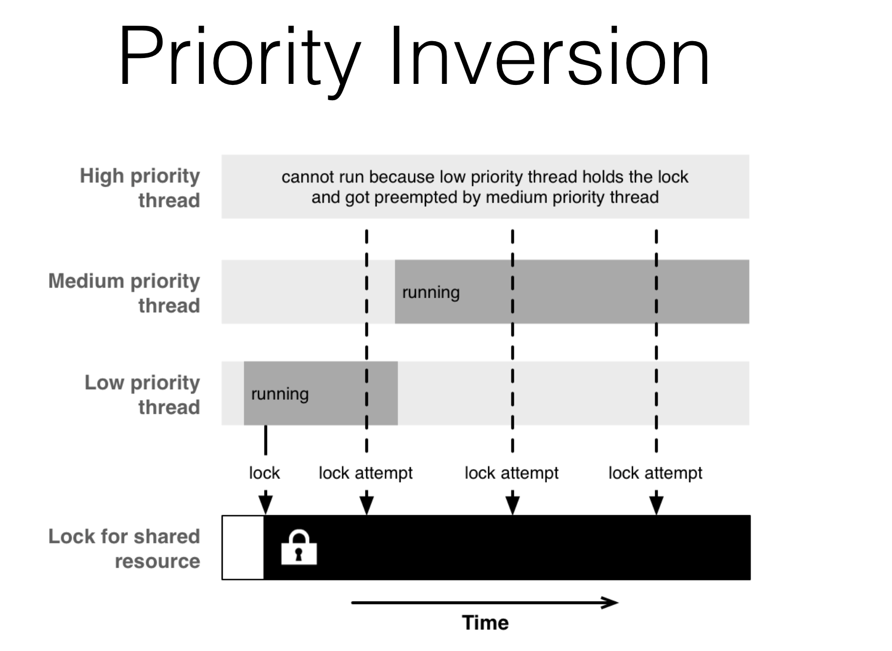

# Concurrency Pitfalls & Challenges

<!-- INSTRUCTOR NOTES:
1)  -->


## Minute-by-Minute [OPTIONAL]

| **Elapsed** | **Time**  | **Activity**              |
| ----------- | --------- | ------------------------- |
| 0:00        | 0:05      | Objectives                |
| 0:05        | 0:15      | Overview                  |
| 0:20        | 0:45      | In Class Activity I       |
| 1:05        | 0:10      | BREAK                     |
| 1:15        | 0:45      | In Class Activity II      |
| TOTAL       | 2:00      |                           |

## Why you should know this or industry application (optional) (5 min)

Concurrency gives us many benefits when it comes to solving performance issues. Today we'll learn about the most well-known problems we can encounter if we are not being careful with our apps.

## Learning Objectives (5 min)

1. Identify, describe, and propose solutions to the following iOS concurrency challenges:
- **Race Conditions**
- **Priority Inversion**
2. Identify and describe how to use __*dispatch barriers*__ to alleviate issues caused by locks and semaphores

## Initial Exercise (15 min)


## Race conditions (10 min)

Let's go back to when we first introduced threads.

**Threads that share the same process, also share the same address space.**

This means that each thread is trying to read and write to the same shared resource. This is how we can run into a situation called: **race condition**.

A race condition happens when multiple threads are trying to write to the same variable at the exact same time.

### An example

Situation: We have two threads executing and both of them are trying to update a count variable.

Facts:
- Reads and writes are separate tasks that the computer cannot execute in a single operation.
- Computers work on *clock cycles* in which each tick of the clock allows a single operation to execute. (As reference, an iPhone XS can perform 2,490,000,000 clock cycles per second 😦)

What we do: `count += 1`

What really happens:
1. We load the value of the variable `count` into memory.
1. We increment the value of `count` by one in memory.
1. We write the updated count back to disk.

(Whiteboard drawing + explaining)

Result: Race conditions lead to complicated debugging due to the non-deterministic characteristic of these scenarios.

How can we solve it: Serial queues 👍🏼

If we have a variable that needs to be accessed concurrently, we can wrap reads and writes in a private queue.

```Swift
private let countQueue = DispatchQueue(label: "countqueue")
private var count = 0
public var count: Int {
  get {
    return countQueue.sync {
      count
    }
  }
  set {
    countQueue.sync {
      count = newValue
    }
  }
}
```

Here we are controlling the access to the variable an making sure that only a single thread a t a time can access the variable.

### Thread barrier
Our previous solution is effective for simple situations. But there are times when the shared resource needs more complex logic in its getters and setters. One thing you might try us using locks and semaphores which is sometimes hard to implement without getting more errors. To make up for that we can use a solution from GCD, called **dispatch barrier**.

The main idea is that we create a concurrent queue where we can process all the read tasks we want, they can all run at the same time. But when the variable needs to be written to, then we lock the queue so that submitted tasks complete but no new submissions are run until the update is done.

(whiteboard diagram)

*Implementation*

```Swift
private let countQueue = DispatchQueue(label: "countqueue", attributes: .concurrent)
private var count = 0
public var count: Int {
  get {
    return countQueue.sync {
      count
    }
  }
  set {
    countQueue.async(flags: .barrier) { [unowned self] in
      self.count = newValue
    }
  }
}
```
(explanation of code snippet)

## Priority Inversion (10 min)

### General Example
In 1995, NASA sent the Pathfinder mission to Mars.

&nbsp;&nbsp;&nbsp;&nbsp;&nbsp;&nbsp;  </br>

Not too long after a successful landing on our red neighboring planet, the mission almost came to an abrupt end.

The Mars rover (Sojourner) kept rebooting for unknown reasons – it suffered from a phenomenon called __*priority inversion*__ where a low-priority thread kept blocking a high-priority one.

### How it happens

The problem can occur when you have a high-priority and a low-priority task share a common resource:

&nbsp;&nbsp;&nbsp;&nbsp;&nbsp;&nbsp;  </br>

- When the low-priority task takes a lock to the common resource, it is supposed to finish off quickly in order to release its lock and to let the high-priority task execute without significant delays.
- Since the high-priority task is blocked from running as long as the low-priority task has the lock, there is a window of opportunity for medium-priority tasks to run and to preempt the low-priority task, because the medium-priority tasks have now the highest priority of all currently runnable tasks.
- At this moment, the medium-priority tasks hinder the low-priority task from releasing its lock, therefore effectively gaining priority over the still waiting, high-priority tasks.


### Priority Inversion in iOS
Since GCD exposes background queues with different priorities, including one which even is I/O throttled, it’s good to know about this possibility.

Priority inversion most commonly occurs in iOS when a queue with a lower quality of service is given a higher system priority than a queue with a higher QoS.
- As a result, blocking, spinning, and polling may occur.

You may recall that the QoS of a Dispatch or an Operation Queue can be changed based on the QoS of the tasks which you, the developer, submit to it.

If you submit multiple tasks to a `.utility` queue with the higher-priority `.userInteractive` QoS, the system could upgrade the QoS of that queue with a priority *higher* than that of a `.userInitiated` queue (i.e., your UI queue). Suddenly, all the tasks in the queue &mdash; most of which are really of the `.utility` QoS &mdash; will end up running before the tasks from the `.userInitiated` (UI) queue.

### How to avoid it
In the case of *synchronous* work, the system will try to resolve the priority inversion automatically by raising the QoS of the lower priority work for the duration of the inversion.<sup>1</sup>

But using multiple queues with different priorities adds even more complexity and unpredictability to concurrent programs.

Thus, it is highly recommended (by Apple) that Developers should try to ensure that priority inversions don’t occur in the first place, so the system isn’t forced to attempt a resolution.

Priority inversion is easy to avoid:
 - In general, don’t use different priorities.
 - If you need a higher QoS, use a different queue that with the desired QoS.
 - When you’re using GCD, always use the default priority queue (directly, or as a target queue)

*Sources:* </br>
- https://www.objc.io/issues/2-concurrency/concurrency-apis-and-pitfalls/
- Resource 2<sup>1</sup> below

## In Class-Activity

### Common questions regarding concurrency in iOS.

In pairs, try to answer as many questions as you can in the time given. Then practice your understanding by taking turns and asking them to each other in an interview format.

1. What is Concurrency?
1. What is Parallelism?
1. What are most commonly used APIs to implement concurrency in iOS?
1. What is a queue? What is their relationship with FIFO?
1. What are all the different types of queues and their priorities?
1. What is the difference between an asynchronous and a synchronous task?
1. What is the difference between a serial and a concurrent queue?
1. How does GCD work?
1. Explain the relationship between a process, a thread and a task.
1. Are there any threads running by default? Which ones?
1. How does iOS support multithreading?
1. What is NSOperation? and NSOPerationQueue?
1. What is QoS?
1. Explain priority inversion.
1. Explain dependencies in Operations.
1. When do you use GCD vs Operations?
1. How do we know if we have a race condition?
1. What is deadlock?
1. What is context switching in multithreading?
1. What are the ways we can execute an Operation? Why are they different?


## After Class

1. Research:
- study **Priority Inversions** section in Resource 2<sup>1</sup> below

2. Assignment(s):
-


## Wrap Up (5 min)

- Continue working on your current tutorial
- Complete reading
- Complete challenges

## Additional Resources

1. [Priority inversion - wikipedia](https://en.wikipedia.org/wiki/Priority_inversion)
2. [Prioritize Work with Quality of Service Classes - from Apple](https://developer.apple.com/library/archive/documentation/Performance/Conceptual/EnergyGuide-iOS/PrioritizeWorkWithQoS.html) <sup>1</sup>
3. [Threading Programming Guide - from Apple](https://developer.apple.com/library/archive/documentation/Cocoa/Conceptual/Multithreading/ThreadSafety/ThreadSafety.html#//apple_ref/doc/uid/10000057i-CH8-SW1)
4. [What really happened on Mars? - and article by Glenn Reeves](https://users.cs.duke.edu/~carla/mars.html)
5. [iOS Concurrency — Underlying Truth - an article](https://medium.com/@chetan15aga/ios-concurrency-underlying-truth-1021a0bb2a98)
