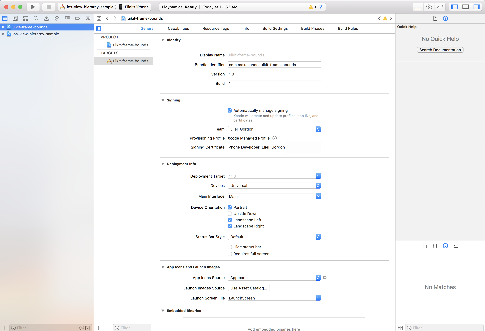

# Xcode Project Management

Have you every wanted to switch between your development, staging and production server in a click of a button?
Have you ever wanted to have a free and paid version of your app using the same codebase? Do you need to create an internal test build?

This lesson covers the basics of Xcode project infrastructure. We will learn about Xcode Schemes & Targets and leverage various tools in Xcode to improve our projects.

## Topics
- Managing Schemes
- Xcode project & workspace
- Xcode Targets
- xcconfig files

## Class Materials

Slides:

[Xcode Project Infrastructure](assets/xcode-project.key)

## Xcode Projects

Each Xcode project is made up of a few components.

### Workspace
This contains one or more related `projects`.

### Project
Projects contain source code, resources files, etc.
Each project can contain one or more targets.

### Targets

Targets define a list of build settings for a project.
They contain a list of classes, resources, custom build scripts etc.. to include use when building a project.
Targets are also used to separate different distributions channels for a project. Eg. I can have a project that has a production, development and testing target.

*Target Use Case Example*
For example, I can have a project with two targets a "free" build and an "paid" build that has extra features and capabilities like background iCloud syncing/healthkit/homekit integration.

Targets offer a few benefits including:

- A target can have multiple build time settings for separate distribution requirements.
- Picking which classes or resources are added to which target.
- Adding tests introduces a new target. This means you can pick and choose which files/resources to include for testing.

*Examples of Targets*
- Test targets
- Application targets (Apps, Games)
- Extension targets (Siri, Keyboard, Today)
- Framework/Library

### Schemes

A scheme defines what happens when you "Build", "Test", "Profile", etc.
Every `target` has at least one scheme to `execute` a target.
Schemes allow you to define environment variables and launch arguements.
Schemes are tied to a build configuration file.

A build scheme is a blueprint for an entire build process, a way of telling Xcode what build configurations you want to use to create the development, unit test, and production builds for a given target (framework or app bundle).

A `Build configuration` is a specific group of build settings that can be applied to a target.

*System Default Scheme and Build settings*

Most app projects come with two build configurations and one build scheme. You get the debug and release build configurations along with a build scheme that runs the debug configuration for debugging purposes and the release configuration for archiving/submission.

You can auto-create schemes for your targets by going to `Product > Scheme > Manage Schemes` and pressing "Autocreate Schemes Now"

## Activity

Discuss use cases for using multiple schemes and targets.

## Challenges

Create an iOS app with a Today Extension as an extra target.

## Resources

[Xcode Schemes & Build Settings Tutorial - Julia Alumni](https://hackernoon.com/a-cleaner-way-to-organize-your-ios-debug-development-and-release-distributions-6b5eb6a48356)
